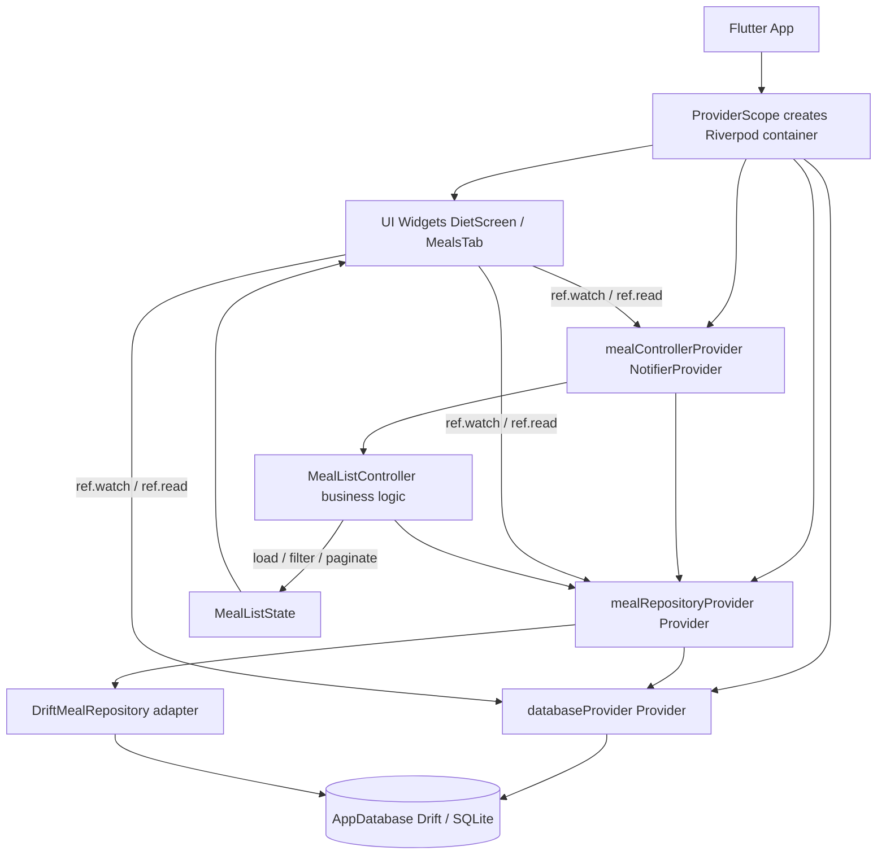

# fitfat

```mermaid
flowchart TD
  App[Flutter App] --> Scope[ProviderScope creates Riverpod container]

  Scope --> UI[UI Widgets DietScreen / MealsTab]
  Scope --> DBP[databaseProvider Provider<AppDatabase>]
  Scope --> REP[mealRepositoryProvider Provider<MealRepository>]
  Scope --> CP[mealControllerProvider NotifierProvider<MealListController, MealListState>]

  DBP --> DB[(AppDatabase Drift / SQLite)]
  REP --> DBP
  CP --> REP

  UI -->|ref.watch / ref.read| CP
  UI -->|ref.watch / ref.read| REP
  UI -->|ref.watch / ref.read| DBP

  CP --> CTRL[MealListController business logic]
  CTRL --> REP
  CTRL -->|load / filter / paginate| STATE[MealListState]
  STATE --> UI

  REP --> IMPL[DriftMealRepository adapter]
  IMPL --> DB
```
