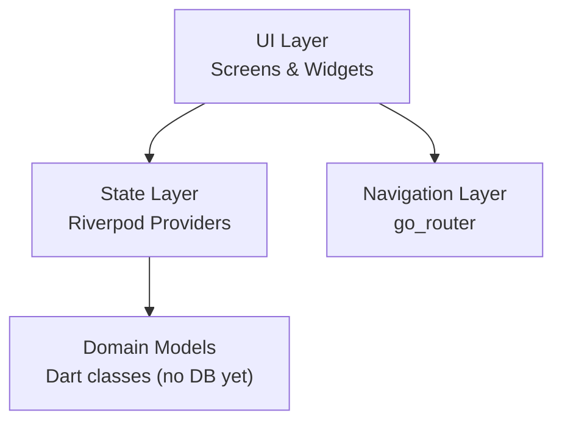

# Architecture

## Layer diagram



## Folder structure

```
lib/
├── main.dart                        # Entry point, ProviderScope
└── src/
    ├── app.dart                     # FitFatApp (MaterialApp.router)
    ├── app_theme.dart               # Material 3 theme (light/dark)
    ├── router/
    │   └── app_router.dart          # GoRouter route definitions
    ├── screens/
    │   ├── food/                    # Food logging tab
    │   ├── exercise/                # Exercise logging tab
    │   ├── dashboard/               # Progress dashboard tab
    │   └── settings/                # Settings & goals tab
    ├── providers/                   # Riverpod providers (mock data in Phase 1)
    └── models/                      # Domain model classes
```

## Routing

GoRouter with 4 top-level routes:
- `/food` — FoodScreen
- `/exercise` — ExerciseScreen
- `/dashboard` — DashboardScreen
- `/settings` — SettingsScreen

Default route: `/food`. Bottom navigation (StatefulShellRoute) added in T02.

## State management

Riverpod (no codegen). Providers written manually.
Phase 1 uses `Provider<T>` returning mock data.
Phase 2 replaces with DB-backed async providers.

## Dependencies

| Package | Version | Purpose |
|---------|---------|---------|
| flutter_riverpod | ^3.3.1 | State management |
| go_router | ^17.2.3 | Declarative routing |
| intl | ^0.20.2 | Date/number formatting |
| fl_chart | ^1.2.0 | Charts (used from T06) |
| uuid | ^4.5.3 | Unique ID generation |
| cupertino_icons | ^1.0.8 | iOS-style icons |
