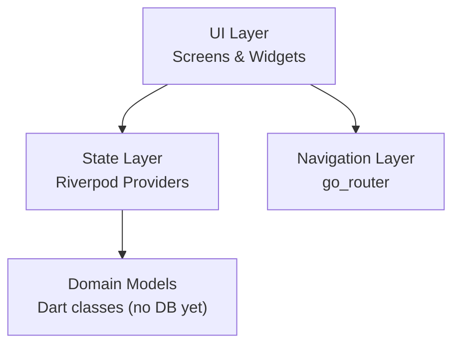

# Architecture

## Layer diagram



## Folder structure

```
lib/
├── main.dart                        # Entry point, ProviderScope, FlutterForegroundTask init
└── src/
    ├── app.dart                     # FitFatApp (MaterialApp.router)
    ├── app_theme.dart               # Material 3 theme (light/dark)
    ├── router/
    │   └── app_router.dart          # GoRouter route definitions (StatefulShellRoute)
    ├── screens/
    │   ├── diet/                    # Diet tab shell + top TabBar
    │   ├── food/                    # Meals tab UI (MealsTab, AddMealScreen, CustomIngredientScreen, FoodEntryCard)
    │   ├── exercise/                # Exercise tab (ExercisesTab, SeancesTab, CurrentSeanceScreen, SeanceLibraryScreen, CreateSeanceScreen)
    │   └── dashboard/               # Progress dashboard tab (DailyNutritionCard, GoalsCard, StrengthTrendChart, BodyweightTrendChart)
    ├── providers/                   # Riverpod providers (mock data in Phase 1)
    │   ├── food_providers.dart      # IngredientListNotifier, MealLogNotifier
    │   ├── exercise_providers.dart  # ActiveSeanceNotifier, SeanceHistoryNotifier
    │   ├── seance_providers.dart    # TemplateListNotifier, ActiveSeancePlanNotifier
    │   └── dashboard_providers.dart # GoalNotifier (Goal?), userProfileProvider, computedMacrosProvider (TDEE), legacyNutritionGoalProvider, chart period, nutrition/daily/monthly, seed data
    ├── models/                      # Domain model classes
    │   ├── food_models.dart         # MacroNutrients, Ingredient, IngredientPortion, MealEntry
    │   ├── exercise_models.dart     # ExerciseDefinition, ExerciseSet, ExerciseEntry, Seance
    │   ├── seance_models.dart       # ExerciseTemplate, SeanceTemplate, ExerciseHistoryItem
    │   └── dashboard_models.dart    # Goal (sealed), UserProfile, Sex, ActivityLevel, BodyWeightDirection, ComputedMacros, NutritionGoal (legacy), StrengthDataPoint, WeightDataPoint, ChartPeriod
    ├── services/
    │   ├── seance_foreground_service.dart   # FlutterForegroundTask wrapper for background timer
    │   └── seance_notification_service.dart  # Notification helpers
    ├── repositories/
    │   ├── seance_repository.dart           # Abstract SeanceRepository port
    │   └── in_memory_seance_repository.dart # In-memory implementation
    └── widgets/
        └── appbar_seance_indicator.dart     # AppBar action for active seance timer
```

## Routing

GoRouter with 3 top-level routes via StatefulShellRoute:
- `/diet` — `DietScreen` (Meals/Ingredients tabs; contextual add action in the `AppBar` switches between add meal and add ingredient)
- `/exercise` — `ExerciseScreen` (Exercises/Seances tabs; shows `CurrentSeanceScreen` when a seance is active)
- `/dashboard` — `DashboardScreen`

Default route: `/diet` (will change to `/dashboard` in T07).

## State management

Riverpod (no codegen). Providers written manually.
Phase 1 uses `Provider<T>` returning mock data.
Phase 2 replaces with DB-backed async providers.

## Dependencies

| Package | Version | Purpose |
|---------|---------|---------|
| flutter_riverpod | ^3.3.1 | State management |
| go_router | ^17.2.3 | Declarative routing |
| intl | ^0.20.2 | Date/number formatting |
| fl_chart | ^1.2.0 | Charts (used from T06) |
| uuid | ^4.5.3 | Unique ID generation |
| cupertino_icons | ^1.0.8 | iOS-style icons |
| flutter_foreground_task | ^9.2.2 | Background timer via foreground service (Android + iOS) |
