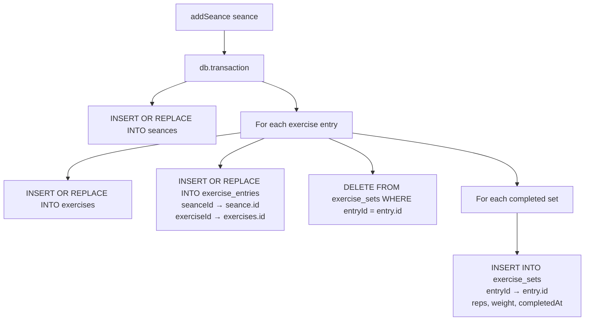
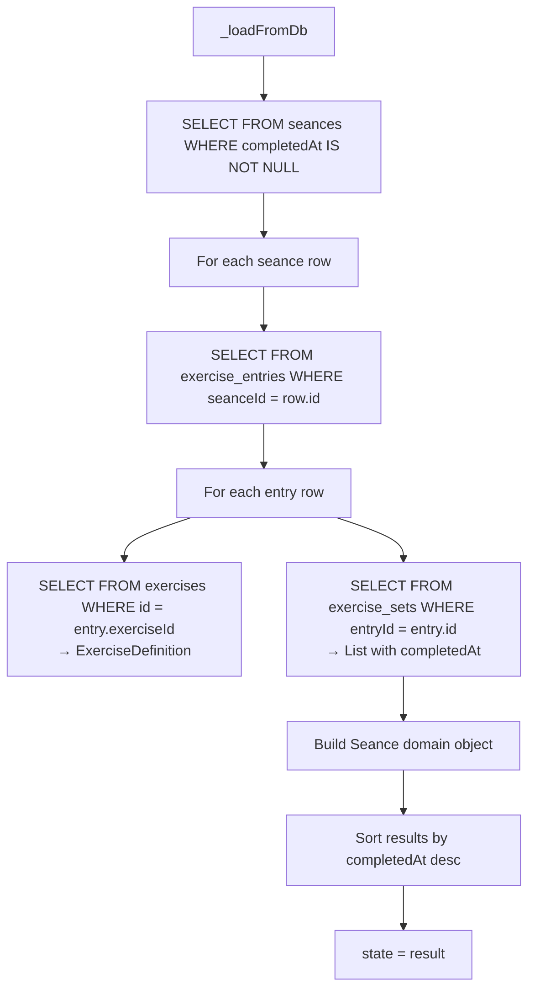

# Seance persistence — save & load flow

## Database schema

### `seances` table
| Column | Type | Notes |
|--------|------|-------|
| `id` | `TEXT PK` | UUID v7 |
| `name` | `TEXT` | Non-nullable `String` (default `''`) |
| `started_at` | `TEXT` (ISO 8601) | |
| `completed_at` | `TEXT?` | `null` → active seance |
| `rest_between_sets_millis` | `INTEGER` | Default 60000 |

### `exercise_entries` table
| Column | Type | FK |
|--------|------|----|
| `id` | `TEXT PK` | |
| `seance_id` | `TEXT` | → `seances.id` |
| `exercise_id` | `TEXT` | → `exercises.id` |
| `started_at` | `TEXT` | |
| `completed_at` | `TEXT?` | |

### `exercise_sets` table
| Column | Type | FK |
|--------|------|----|
| `id` | `TEXT PK` | |
| `entry_id` | `TEXT` | → `exercise_entries.id` |
| `reps` | `INTEGER` | |
| `weight` | `REAL` | |
| `completed_at` | `TEXT?` | nullable — added in schema v5 |

### `exercises` table
| Column | Type |
|--------|------|
| `id` | `TEXT PK` |
| `name` | `TEXT` |
| `category` | `TEXT` |
| `creator_id` | `TEXT` |

---

## Domain model

```
Seance
 ├── id: String
 ├── name: String
 ├── startedAt: DateTime
 ├── completedAt: DateTime?
 ├── restBetweenSets: Duration
 └── exercises: List<ExerciseEntry>
       ├── id: String
       ├── exercise: ExerciseDefinition  (id, name, category)
       ├── startedAt: DateTime
       ├── completedAt: DateTime?
       └── sets: List<ExerciseSet>
             ├── reps: int
             ├── weight: double
             └── completedAt: DateTime?    ← isCompleted = completedAt != null
```

---

## Save flow (`_saveToDb` in `SeanceHistoryNotifier`)

Called by `addSeance()` when completing a seance. Runs inside a **single SQLite transaction** (`db.transaction(() async { ... })`).



Key details:
- `seances` uses `InsertMode.insertOrReplace` → one row per id
- `exercises` also uses `insertOrReplace` 
- `exercise_sets` uses **delete-then-insert**: deletes all existing sets for an entry, then inserts completed ones
- Only sets where `isCompleted == true` are saved (line 431-433)
- `completedAt` on each set is now persisted (line 443 — T04 fix)

---

## Load flow (`_loadFromDb` in `SeanceHistoryNotifier`)

Called once from `build()` on notifier creation. Restores all completed seances from the DB.



Key details:
- Only rows where `completedAt IS NOT NULL` are loaded (active seances are managed separately via `watchedSeance`)
- Each `ExerciseSet` is reconstructed with `completedAt: setRow.completedAt` (line 349 — T04 fix)
- Results are sorted most-recent-first

---

## Live persistence during active seance

While the seance is in progress, the **active seance state** is persisted via `SharedPreferences` (JSON round-trip), NOT the database. This allows the seance to survive app restarts.

```
ActiveSeanceNotifier
 ├── state = Seance (in-memory)
 ├── _persist() → SharedPreferences.setString('active_seance_json', jsonEncode(seance.toJson()))
 └── restoreFromPrefs() → SharedPreferences.getString → Seance.fromJson
```

The DB is only written when the seance is completed (`addSeance` → `_saveToDb`).

---

## Race condition guard

`addSeance()` calls `_saveToDb()` **before** updating in-memory `state`. This ensures that if the notifier's `build()` fired `_loadFromDb()` asynchronously and it's still in-flight, it will find the new seance in the DB and not overwrite memory with an empty list.

```dart
Future<void> addSeance(Seance seance) async {
  await _saveToDb(seance);           // DB first
  state = [seance, ...state];        // then memory
}
```
