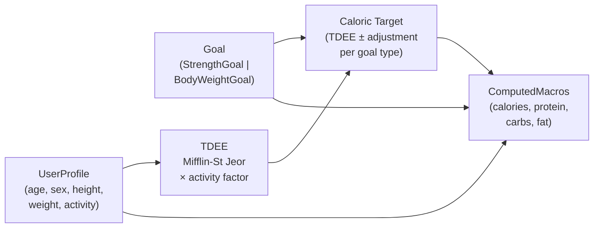

# Goals & Macros System

How fitfat computes daily macro targets from the user's fitness goal and profile.

## Data flow



## Goal types

### StrengthGoal
- Fields: `exerciseName`, `targetWeightKg`, `targetDate` (optional)
- Caloric target: TDEE (maintenance)
- Protein: 2.2 g/kg bodyweight
- Fat: 25% of total calories
- Carbs: remaining calories

### BodyWeightGoal
- Fields: `targetWeightKg`, `direction` (gain/lose/maintain), `targetDate` (optional)
- Caloric target: TDEE +300 (gain), TDEE −500 (lose), TDEE (maintain)
- Protein: 2.0 g/kg (gain), 2.4 g/kg (lose), 1.8 g/kg (maintain)
- Fat: 25% of total calories
- Carbs: remaining calories

## User profile

Fields: age (int), sex (Male/Female), height (cm), weight (kg), activity level.

### Activity levels

| Level | Factor | Description |
|-------|--------|-------------|
| Sedentary | 1.2 | Little/no exercise |
| Light | 1.375 | 1–3 days/week |
| Moderate | 1.55 | 3–5 days/week |
| Active | 1.725 | 6–7 days/week |
| Very Active | 1.9 | Twice daily / physical job |

## BMR formula (Mifflin-St Jeor)

```
Male:   BMR = 10 × weight + 6.25 × height − 5 × age + 5
Female: BMR = 10 × weight + 6.25 × height − 5 × age − 161
```

TDEE = BMR × activity factor.

## Providers

| Provider | Type | Purpose |
|----------|------|---------|
| `userProfileProvider` | `NotifierProvider<UserProfileNotifier, UserProfile?>` | Holds user profile (null until set) |
| `goalProvider` | `NotifierProvider<GoalNotifier, Goal?>` | Holds current goal (null until set) |
| `computedMacrosProvider` | `Provider<ComputedMacros>` | Derived: computes macros from profile + goal |
| `legacyNutritionGoalProvider` | `Provider<NutritionGoal>` | Wraps ComputedMacros into old shape (for legacy consumers, removed in T09) |

## Key files

- `lib/src/models/dashboard_models.dart` — sealed `Goal`, `UserProfile`, enums, `ComputedMacros`
- `lib/src/providers/dashboard_providers.dart` — TDEE logic, all goal/profile providers
- `lib/src/screens/dashboard/dashboard_screen.dart` — `ProfileSetupDialog`, `GoalTypeSelectorDialog`, `GoalsCard`, `DailyNutritionCard`

See also: [overview.md](../overview.md)
