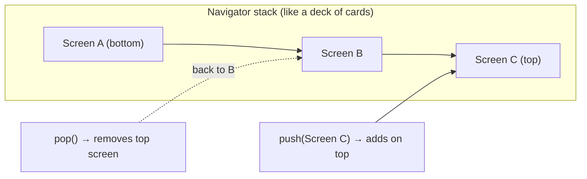
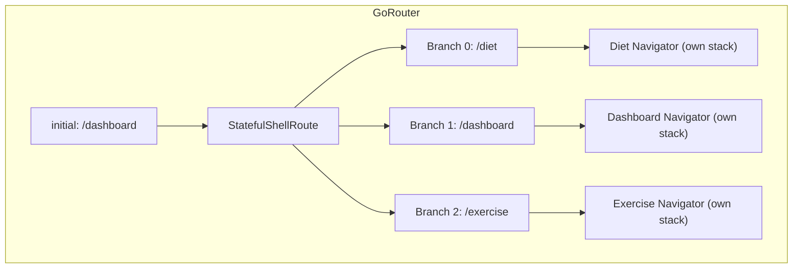
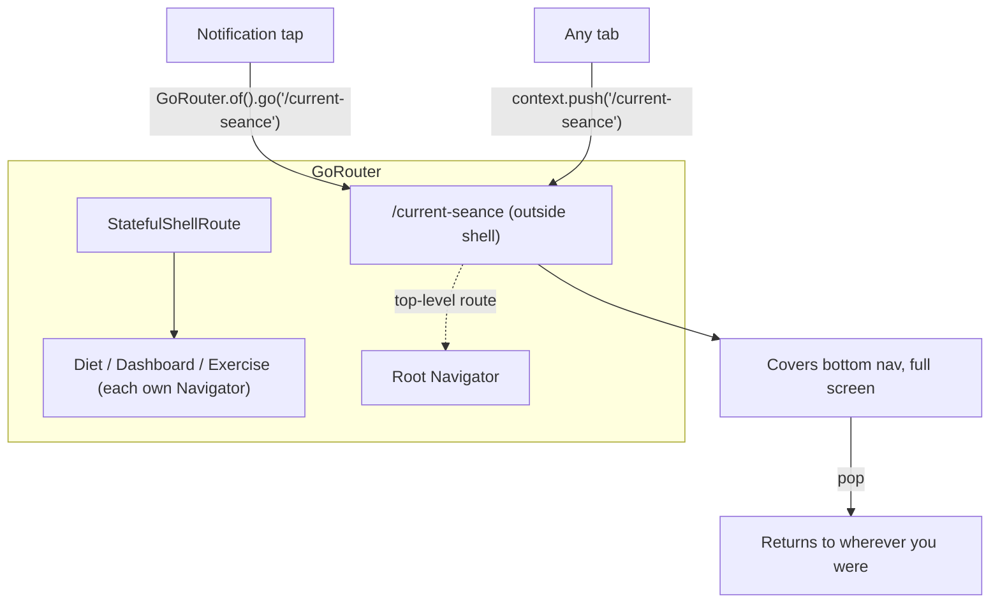

# Flutter Navigation Concepts

A guide to routing and navigation in this project.

---

## Summary (2-minute read)

**Navigator** = a stack of screens (push adds, pop removes). **GoRouter** = declares routes centrally. **StatefulShellRoute** = keeps each tab's navigation stack alive. **BuildContext** = a widget's position in the tree, used to find the nearest Navigator.

In a tabbed app (like fitfat), each tab has its own Navigator stack. If you push a screen from inside the Diet tab, it only covers the Diet tab — the bottom nav and other tabs keep showing. To show a screen that covers the whole app (like a running seance), you need a **global GoRouter route** registered outside the shell.

---

## Diagrams

### How Navigator works



### Current fitfat routing



Each branch has its own `Navigator`. `Navigator.of(context)` finds the **nearest** one. Pushing from Diet → only Diet sees it.

### Where the seance should live



---

## 1. Navigator

A widget that manages a **stack of pages** (routes). Push adds to the top, pop removes from the top — like a deck of cards.

```dart
Navigator.of(context).push(MaterialPageRoute(builder: (_) => MyScreen()));
Navigator.of(context).pop(); // go back
```

- [Navigator class docs](https://api.flutter.dev/flutter/widgets/Navigator-class.html)

### The problem

`Navigator.of(context)` finds the **nearest** Navigator ancestor. In a `StatefulShellRoute`, each tab has its **own Navigator**. So pushing from Diet only overlays Diet — Exercise doesn't see it.

---

## 2. GoRouter

GoRouter declares routes declaratively instead of pushing pages manually. Routes can be nested inside shells or registered at the **top level**.

```dart
GoRoute(path: '/dashboard', builder: (_, __) => DashboardScreen())
```

- [GoRouter docs](https://pub.dev/documentation/go_router/latest/)

### Ways to navigate

```dart
context.go('/page');          // Replace current location (no back button)
context.push('/page');        // Push on top (back button returns to previous)
context.pop();                 // Go back
GoRouter.of(context).go('/page'); // Explicit, works without context in some cases
```

---

## 3. StatefulShellRoute

GoRouter's way of creating **persistent bottom navigation tabs**. Each tab keeps its own Navigator stack.

- [StatefulShellRoute docs](https://pub.dev/documentation/go_router/latest/go_router/StatefulShellRoute-class.html)

```
StatefulShellRoute
├── Branch 0: /diet       → Diet Navigator
├── Branch 1: /dashboard  → Dashboard Navigator
└── Branch 2: /exercise   → Exercise Navigator
```

---

## 4. BuildContext

A handle to a widget's position in the widget tree. Used to find ancestors:

```dart
Navigator.of(context);   // Finds nearest Navigator
Theme.of(context);       // Finds nearest Theme
```

In a tabbed app, `context` inside Diet gives Diet's Navigator, not Exercise's.

---

## 5. Seance routing decision

### Why not Option 1 (Navigator.push inside the tab)?

```dart
Navigator.of(context).push(MaterialPageRoute(
  builder: (_) => CurrentSeanceScreen(),
));
```

- ❌ Only visible inside the current tab
- ❌ Notification can't navigate to it easily
- ❌ Other tabs still show their content behind it

### Why Option 3 (GoRouter global route)

```dart
// Registered in app_router.dart, outside StatefulShellRoute
GoRoute(path: '/current-seance', builder: (_, __) => CurrentSeanceScreen())

// Navigate from anywhere:
context.push('/current-seance');
// From notification:
GoRouter.of(navigatorKey.currentContext!).go('/current-seance');
```

- ✅ Works from **anywhere** (Diet, Dashboard, Exercise, notification)
- ✅ Covers bottom nav bar (full-screen, modal-like)
- ✅ Back button returns to wherever you were
- ✅ One line to add in `app_router.dart`, no tab lifecycle issues

---

## Reference links

| Concept | Link |
|---------|------|
| Navigator + routes | https://docs.flutter.dev/ui/navigation |
| Navigator class | https://api.flutter.dev/flutter/widgets/Navigator-class.html |
| GoRouter | https://pub.dev/documentation/go_router/latest/ |
| GoRouter recipes | https://docs.flutter.dev/ui/navigation#using-go_router |
| StatefulShellRoute | https://pub.dev/documentation/go_router/latest/go_router/StatefulShellRoute-class.html |
| BuildContext | https://api.flutter.dev/flutter/widgets/BuildContext-class.html |
| MaterialPageRoute | https://api.flutter.dev/flutter/material/MaterialPageRoute-class.html |
