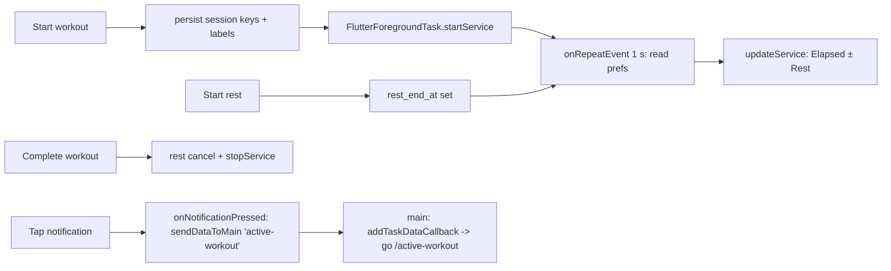
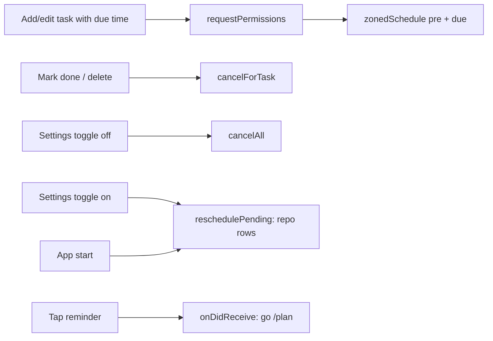

# Notifications

The notifications domain covers two subsystems in `lib/src/notifications/`:

1. **Active-workout notifications** — in-app rest timer on the active-workout screen plus an ongoing Android notification (workout duration + remaining rest) via `flutter_foreground_task`, with a best-effort iOS notification via `flutter_local_notifications`.
2. **Planner task reminders** — scheduled notifications for planner tasks with a due time (due-time + 30-min pre-reminder) via `flutter_local_notifications` + `timezone`/`flutter_timezone` (T11).

## Files

| File | Purpose |
|------|---------|
| `lib/src/notifications/rest_timer.dart` | `RestTimerState` / `RestTimerNotifier` (Riverpod `Notifier`, `restTimerProvider`) persisting `rest_end_at`; shared `formatRestDuration` (mm:ss, h:mm:ss ≥ 1 h) |
| `lib/src/notifications/active_workout_notifier.dart` | `ActiveWorkoutNotifier`/`activeWorkoutNotifierProvider` (UI side: start/stop, permission, iOS best-effort) + `activeWorkoutTaskCallback` entry point and `ActiveWorkoutTaskHandler` (background notification text) |
| `lib/main.dart` | `FlutterForegroundTask.initCommunicationPort()` + `init(...)` — channel `active_workout`, 1 s `repeat` event, no auto-run on boot; registers the tap-routing `addTaskDataCallback` (T06) |
| `lib/src/exercise/screens/workout_detail.dart` | Start wiring (pending screen only) |
| `lib/src/exercise/screens/active_workout_screen.dart` | Complete wiring + `_RestTimerCard` (moved here in active-workout-flow T04) |

## Rest timer

- `restTimerProvider` → `RestTimerState { DateTime? endAt, String? setId, int? plannedSeconds }`; `startRest(Duration, {String? setId})` / `cancelRest()`.
- `rest_end_at` (epoch millis) persisted in `shared_preferences` so the **background callback** can render remaining time; expired rests auto-clear in both the handler and the UI ticker.
- **Set context (active-workout-flow T05)**: `startRest` also persists `rest_set_id` + `rest_planned_seconds` when started for a set (auto-start from set completion); manual preset-chip rests have no `setId` and are not recorded. `build()` restores all three keys so recording survives a provider rebuild mid-rest. The background handler clears the set keys too when an expired rest is cleaned up.
- **Recording (T05, user-approved design — centralized in `cancelRest()`)**: when a set-based rest ends (UI ticker sees expiry), is cancelled early, or the workout is completed, `cancelRest()` writes `actual_rest_seconds` (planned − rounded remaining, clamped ≥ 0; expired ⇒ planned) via `WorkoutRepository.recordSetRest`, then clears all three keys. `_completeWorkout` already calls `cancelRest()` first, so the in-flight rest is recorded on completion.
- **Auto-start (T05)**: completing a set in `ActiveWorkoutScreen` starts the rest timer with that set's planned rest (`set.restSeconds`), skipped when no other incomplete set remains or the set has no planned rest.
- UI: card on the active-workout screen (`ActiveWorkoutScreen`), **preset chips 2 / 3 / 4 / 5 / 6 min** (user decision 2026-08-06), live mm:ss countdown via 1 s `Timer.periodic`, cancel button. Moved from the workout detail with the Complete action in active-workout-flow T04.
- Persists across navigation (countdown continues, shown in the notification).

## Foreground notification (Android)

- Lifecycle: workout Start → persist session keys → `FlutterForegroundTask.startService(serviceId: 256, ...)` (or `restartService()` if already running); each 1 s tick the handler rebuilds the text; Complete → `stopService()`.
- `ActiveWorkoutTaskHandler` is registered via the top-level `@pragma('vm:entry-point') activeWorkoutTaskCallback`; it runs in a background isolate with its own FlutterEngine, so `shared_preferences` is readable there. `onRepeatEvent` calls `FlutterForegroundTask.updateService(...)`.
- Text format: `Elapsed 12:34` / `Elapsed 12:34 · Rest 0:45`.
- Session keys: `active_workout_name`, `active_workout_started_at`; localized fragments `notification_elapsed_label` / `notification_rest_label` — notification language is fixed at workout start (`AppLocalizations` is unavailable in the background isolate).
- Android 13+ `POST_NOTIFICATIONS` requested via `permission_handler` (`Permission.notification`); if denied the service still runs but the notification is hidden.
- Channel set in `main()`: `active_workout`, English name/description (system-level, set before l10n loads), `onlyAlertOnce: true`.
- **Tap routing (active-workout-flow T06)**: `ActiveWorkoutTaskHandler.onNotificationPressed()` sends `FlutterForegroundTask.sendDataToMain('active-workout')` to the UI isolate. `main()` registers `addTaskDataCallback`, ignores non-`'active-workout'` payloads, gates on the active session key (`active_workout_name`), and calls `appRouter.go('/active-workout')` — deferred via `addPostFrameCallback` when the router navigator isn't mounted yet (cold start can deliver the signal before the first frame). `startService(...)` sets `notificationInitialRoute: '/active-workout'` (Android cold start); `restartService()` is untouched because flutter_foreground_task 9.2.2's `restartService` takes no options, so the already-running service keeps the route stored at its own start.

## iOS (best-effort, per plan)

- `Platform.isIOS` guard: `flutter_local_notifications` (v18, `DarwinInitializationSettings`) shows once on workout start — no updates while backgrounded. No iOS foreground-service parity.

## Wiring

`main()` initializes the service once. `_startWorkout` in `workout_detail.dart` drives start (the detail Start button redirects to `/active-workout`); `_completeWorkout` + the rest card live on `ActiveWorkoutScreen`.

---

# Planner Task Reminders (T11)

Scheduled due-time + pre-reminder notifications for planner tasks, governed by a single app-wide Settings toggle (`plannerNotifications`, default **on**).

## Files

| File | Purpose |
|------|---------|
| `lib/src/notifications/task_reminders.dart` | `TaskReminderScheduler` + `taskReminderSchedulerProvider` (overridden in `main()`), pure `plannerReminderTimes` helper, channel/payload/pre-reminder consts |
| `lib/src/main.dart` | `timezone` init (`FlutterTimezone.getLocalTimezone`), plugin init + tap→`/plan` routing + cold-start launch replay, `ProviderScope` override |
| `lib/src/app/app.dart` | `MaterialApp.router` `builder` → `_StartupReminderSync` (one-shot startup reschedule, l10n-aware) |
| `lib/src/planner/screens/planner_screen.dart` | mutation hooks (add/edit/done/delete/undo/copy) |
| `lib/src/settings/providers/settings.dart` + `screens/settings_screen.dart` | `plannerNotifications` toggle (cancel-all / restore) |

## Scheduler behavior

- **Two reminders per timed task**: the 30-min pre-reminder (`preReminderMinutes = 30`) then the due-time one. Notification title = task title; bodies are the localized `taskReminderDueSoon` / `taskReminderDueNow`. A pre-reminder that would land in the past is skipped; a task that is done, untimed, or already past-due never schedules (`plannerReminderTimes`).
- **Deterministic ids**: FNV-1a hash of the task id → `dueNotificationId(taskId)` / `preReminderNotificationId(taskId)` (30-bit space), so edit re-schedules in place and done/delete cancels precisely across restarts.
- **Registry**: `scheduledTasksKey` prefs JSON array of task ids with live notifications, so the toggle can `cancelAll()` without killing the active-workout notification (which lives on the separate foreground-service channel).
- **Android**: channel `planner_reminders` (`importance/priority` default), `AndroidScheduleMode.inexactAllowWhileIdle` (no exact-alarm permission), boot persistence via `ScheduledNotificationBootReceiver` + `RECEIVE_BOOT_COMPLETED` in the manifest. **iOS**: `DarwinNotificationDetails`, `UILocalNotificationDateInterpretation.absoluteTime`.
- **Tap → Plan tab**: scheduled notifications carry `payload = plannerReminderPayload`; `onDidReceiveNotificationResponse` (and `getNotificationAppLaunchDetails` replay on cold start) route to `/plan` via `main()`'s `_openPlanTab` (deferred to first frame when the navigator isn't mounted).
- **Permission**: `requestPermissions()` prompts Android 13+ (`requestNotificationsPermission`) / iOS at user-initiated scheduling time only (the planner dialog path); startup rescheduling never prompts.
- **Lifecycle**: `reschedulePending(repository)` cancels all then re-schedules `getUpcomingWithDueTime(now)` rows. Runs on startup (`_StartupReminderSync`, post-frame, l10n-aware, respects the toggle) and when the toggle flips back on. Planner mutations (add/edit/done/delete/undo/copy) call `scheduleForItem`/`cancelForTask` directly, gated on the toggle.

See also: [overview.md](../overview.md), [architecture.md](../architecture.md), [exercise/workout-crud.md](../exercise/workout-crud.md), [planner/planner.md](../planner/planner.md), [settings/settings.md](../settings/settings.md)
