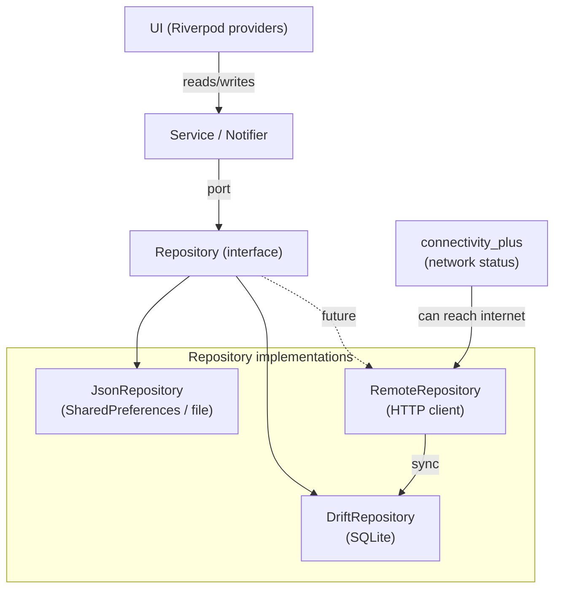
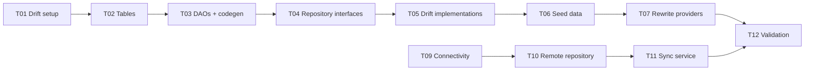

# Plan: data-layer-overhaul

Move from in-memory providers to a proper data layer with Drift (SQLite) for historical/relational data, lightweight persistence for active state, and an interface for remote sync.

---

## Architecture



### Data ownership

| Data store | What lives there | Why |
|---|---|---|
| **Drift (SQLite)** | exercises, ingredients, meals, seance history, templates, goals, user profile | Relational — query "all meals on date X", "last 5 seances", "strength goals for exercise Y" |
| **JSON / SharedPreferences** | active seance, user preferences (theme, units) | Single objects, no relations. Active seance needs atomic write more than queryability |
| **HTTP / Remote** | exercise definitions, ingredient catalog (future) | Global database, regularly updated, synced on demand |

---

## Task list

### T01: Drift setup — database class + dependency (status:done)
- **Completed**: 2026-05-21
- **Files**: `pubspec.yaml`, `build.yaml`, `lib/src/database/app_database.dart`, `lib/src/database/tables.dart`

### T02: Define Drift tables (status:done)
- **Completed**: 2026-05-21
- **13 tables**: exercises, ingredients, meals, meal_ingredients, seances, exercise_entries, exercise_sets, templates, template_exercises, template_sets, goals, user_profile, body_weight_entries

### T03: Codegen + query methods (status:done)
- **Completed**: 2026-05-21
- **Files**: `lib/src/database/app_database.dart` (all query methods inlined on `AppDatabase` class), `lib/src/database/app_database.g.dart` (generated)

### T04: Seed data + database provider (status:done)
- **Completed**: 2026-05-21
- Added `migrationStrategy` with `onCreate` that seeds 10 default exercises and 12 default ingredients
- Created `lib/src/providers/database_providers.dart` with `databaseProvider` (singleton `AppDatabase`)
- **Files**: `lib/src/database/app_database.dart`, `lib/src/providers/database_providers.dart`
- **Verification**: `flutter analyze` — 0 issues; `flutter test` — 6/6 passed.

### T05: Rewrite exercise provider (status:done)
- **Completed**: 2026-05-21
- Changed `exerciseListProvider` from `Provider<List>` to `NotifierProvider<ExerciseListNotifier, List>`. Same consumer-facing type — no UI changes. `ExerciseListNotifier.build()` calls `_loadFromDb()` which reads from Drift and sets state. Falls back to empty `[]` if DB is empty or not ready yet.
- Removed `_seedExercises()` (no longer needed — seed data comes from DB `onCreate`).
- **Verification**: `flutter analyze` — no errors; `flutter test` — 6/6 passed.

### T06: Rewrite food provider (status:deferred)
- Deferred — food model uses composite ingredients (`Ingredient.fromComponents`) which the flat DB tables don't support. Needs schema changes and aligned seed data.

### T07: Rewrite seance/template provider (status:done)
- **Completed**: 2026-05-21
- Implemented `DriftSeanceRepository` (full `SeanceRepository` port) with:
  - 3-level CRUD through `templates` → `template_exercises` → `template_sets` tables
  - Cascade delete on template removal
  - Full assemble on read (joins sets + exercises into nested `SeanceTemplate`)
- Switched `seanceRepositoryProvider` from `InMemorySeanceRepository` to `DriftSeanceRepository`
- Updated tests: both widget tests and unit tests override the repo with `InMemorySeanceRepository` to avoid DB dependency
- **Verification**: `flutter analyze` — no errors; `flutter test` — 6/6 passed.

### T08: Rewrite dashboard/goal/profile provider (status:todo)
- Replace `userProfileProvider`, `goalsProvider`, seed data with DB-backed versions
- **Files**: `lib/src/providers/dashboard_providers.dart`

### T09: Validation & fix tests (status:todo)
- Run `flutter analyze`, fix any issues, update widget tests to work with DB
- **Files**: `test/`

### T10: Network connectivity detection (status:todo)
- **Goal**: Add `connectivity_plus` package. Create a `ConnectivityService` that exposes `isOnline` stream.
- **Files**: `lib/src/services/connectivity_service.dart`
- **Done when**: Provider emits `true`/`false` based on actual network state.

### T10: Remote repository interface + HTTP sync (status:todo)
- **Goal**: Define `RemoteSyncRepository` port with methods like `fetchLatestExercises(since: DateTime)`. Create a `HttpRemoteRepository` that calls a REST API (stub for now, real endpoint later).
- **Files**: `lib/src/repositories/interfaces/remote_sync_repository.dart`, `lib/src/repositories/remote/http_remote_repository.dart`
- **Done when**: Interface defined, HTTP adapter compiles (can return stub data).

### T11: Sync service — orchestrate local ↔ remote (status:todo)
- **Goal**: `SyncService` that watches connectivity, triggers sync when online. Compares `lastSyncedAt`, fetches new data from remote, upserts into Drift.
- **Files**: `lib/src/services/sync_service.dart`
- **Done when**: Triggering sync inserts/updates exercises in Drift, UI reacts.

### T12: Validation & context sync (status:todo)
- **Goal**: `flutter analyze`, `flutter test`, update context files.
- **Verification**: `flutter analyze` clean; `flutter test` passes.

---

## Dependency graph



T01-T08 are the local path. T09-T11 is the remote sync path (can be deferred).

---

## How to know when internet is reachable

Use `connectivity_plus` to detect network changes. Combine with an actual HTTP check (ping a known endpoint) to avoid false positives (connected to WiFi but no internet).

```dart
Stream<bool> get isOnline => Connectivity().onConnectivityChanged.map(
  (result) => result != ConnectivityResult.none,
);
```

For the sync service, debounce rapid changes (e.g., wait 2 seconds after coming online before syncing).

---

File: `context/plans/data-layer-overhaul.md`
