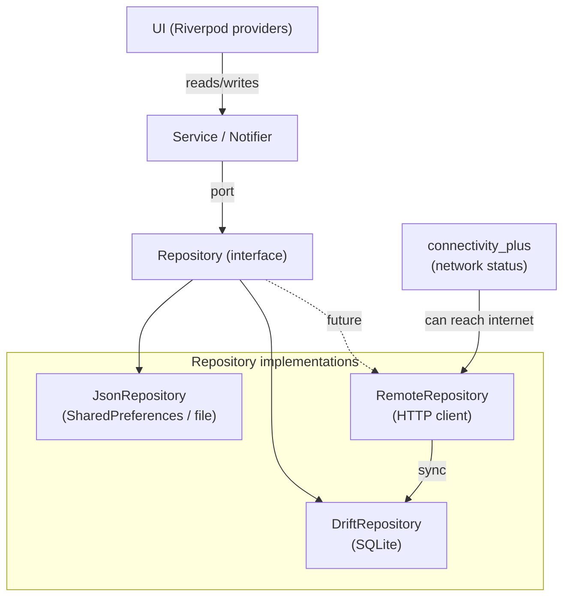
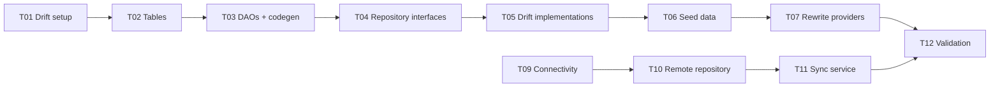

# Plan: data-layer-overhaul

Move from in-memory providers to a proper data layer with Drift (SQLite) for historical/relational data, lightweight persistence for active state, and an interface for remote sync.

---

## Architecture



### Data ownership

| Data store | What lives there | Why |
|---|---|---|
| **Drift (SQLite)** | exercises, ingredients, meals, seance history, templates, goals, user profile | Relational — query "all meals on date X", "last 5 seances", "strength goals for exercise Y" |
| **JSON / SharedPreferences** | active seance, user preferences (theme, units) | Single objects, no relations. Active seance needs atomic write more than queryability |
| **HTTP / Remote** | exercise definitions, ingredient catalog (future) | Global database, regularly updated, synced on demand |

---

## Task list

### T01: Drift setup — database class + dependency (status:todo)
- **Goal**: Add `drift`, `sqlite3_flutter_libs`, `drift_dev`, `build_runner` deps. Create `build.yaml`. Define `AppDatabase` class with connection.
- **Files**: `pubspec.yaml`, `build.yaml`, `lib/src/database/app_database.dart`
- **Done when**: `flutter analyze` passes, database class compiles.

### T02: Define Drift tables — exercise, ingredient, meal, seance, template, goal, profile (status:todo)
- **Goal**: One Drift table per domain model. Include all columns needed for queries (dates, foreign keys, computed fields).
- **Tables**:
  - `exercises` — id, name, category, lastSyncedAt
  - `ingredients` — id, name, caloriesPer100g, proteinPer100g, carbsPer100g, fatPer100g, lastSyncedAt
  - `meals` — id, name, eatenAt, notes
  - `meal_ingredients` — id, mealId (FK), ingredientId (FK), grams
  - `seances` — id, name, startedAt, completedAt, restBetweenSets (not persisted as Duration)
  - `exercise_entries` — id, seanceId (FK), exerciseId (FK), startedAt, completedAt
  - `exercise_sets` — id, entryId (FK), reps, weight
  - `templates` — id, name
  - `template_exercises` — id, templateId (FK), name (denormalized)
  - `template_sets` — id, templateExerciseId (FK), reps, weightKg, restSeconds
  - `goals` — id, type (strength|bodyweight), exerciseName (nullable), targetWeightKg, direction (nullable), targetDate (nullable)
  - `user_profile` — id (singleton), birthDate, sex, heightCm, weightKg, activityLevel
- **Files**: `lib/src/database/tables.dart`
- **Done when**: All tables defined, `dart run build_runner build` succeeds.

### T03: Generate DAOs + data classes (status:todo)
- **Goal**: Run Drift codegen. Create DAOs with `watchAll()`, `insert`, `update`, `delete` methods per domain.
- **Files**: `lib/src/database/daos/` (one DAO per domain)
- **Done when**: Generated `database.g.dart` compiles, DAOs attach to `AppDatabase`.

### T04: Repository interfaces — define ports for each domain (status:todo)
- **Goal**: One abstract interface class per domain defining read/write operations. Ports are platform-independent (no Flutter/Drift types in signatures).
- **Files**: `lib/src/repositories/interfaces/` — `ExerciseRepository`, `IngredientRepository`, `MealRepository`, `SeanceRepository`, `TemplateRepository`, `GoalRepository`, `ProfileRepository`
- **Done when**: All interfaces defined, compile clean.

### T05: Drift repository implementations (status:todo)
- **Goal**: One implementation per interface that delegates to Drift DAOs. Every method returns `Future` or `Stream`.
- **Files**: `lib/src/repositories/drift/`
- **Done when**: All methods implemented, analyzer clean.

### T06: Seed data migration (status:todo)
- **Goal**: Insert default exercises, seed ingredients on first launch if DB is empty. Use `migrationStrategy` or `beforeOpen` callback.
- **Files**: `lib/src/database/app_database.dart`
- **Done when**: Fresh install shows same exercise list as current in-memory seed.

### T07: Rewrite Riverpod providers to use repositories (status:todo)
- **Goal**: Replace in-memory NotifierProviders with StreamProvider / FutureProvider that read from Drift repositories. Write operations go through repository methods.
- **Files**: `lib/src/providers/` — all 4 files
- **Done when**: All existing UI screens work with DB-backed data. `flutter analyze` clean, tests pass.

### T08: Active seance — keep SharedPreferences for now (status:done)
- Already implemented with JSON serialization via SharedPreferences.
- Will be moved to Drift in a follow-up if it becomes relational (e.g., querying active seance exercises).

### T09: Network connectivity detection (status:todo)
- **Goal**: Add `connectivity_plus` package. Create a `ConnectivityService` that exposes `isOnline` stream.
- **Files**: `lib/src/services/connectivity_service.dart`
- **Done when**: Provider emits `true`/`false` based on actual network state.

### T10: Remote repository interface + HTTP sync (status:todo)
- **Goal**: Define `RemoteSyncRepository` port with methods like `fetchLatestExercises(since: DateTime)`. Create a `HttpRemoteRepository` that calls a REST API (stub for now, real endpoint later).
- **Files**: `lib/src/repositories/interfaces/remote_sync_repository.dart`, `lib/src/repositories/remote/http_remote_repository.dart`
- **Done when**: Interface defined, HTTP adapter compiles (can return stub data).

### T11: Sync service — orchestrate local ↔ remote (status:todo)
- **Goal**: `SyncService` that watches connectivity, triggers sync when online. Compares `lastSyncedAt`, fetches new data from remote, upserts into Drift.
- **Files**: `lib/src/services/sync_service.dart`
- **Done when**: Triggering sync inserts/updates exercises in Drift, UI reacts.

### T12: Validation & context sync (status:todo)
- **Goal**: `flutter analyze`, `flutter test`, update context files.
- **Verification**: `flutter analyze` clean; `flutter test` passes.

---

## Dependency graph



T01-T08 are the local path. T09-T11 is the remote sync path (can be deferred).

---

## How to know when internet is reachable

Use `connectivity_plus` to detect network changes. Combine with an actual HTTP check (ping a known endpoint) to avoid false positives (connected to WiFi but no internet).

```dart
Stream<bool> get isOnline => Connectivity().onConnectivityChanged.map(
  (result) => result != ConnectivityResult.none,
);
```

For the sync service, debounce rapid changes (e.g., wait 2 seconds after coming online before syncing).

---

File: `context/plans/data-layer-overhaul.md`
