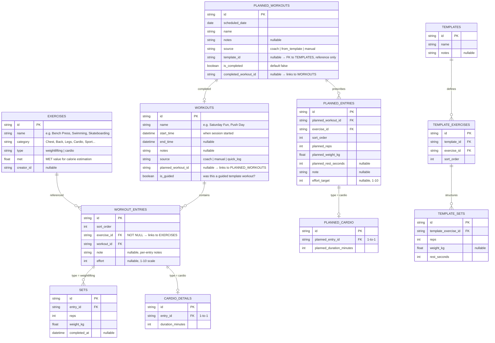

# Exercise Domain Rethink: Unified Activity Model + Planning

## Change Summary

Rethink the exercise module from a weights-only "seance" system into a **unified activity model** supporting weightlifting, cardio, and freeform activities. Replace the "Workouts" tab with a **"Training" tab** that combines planning (weekly calendar), timeline (what you did), and history. Introduce **quick-log** for spontaneous sessions and **planned workouts** for coach-scheduled or self-scheduled sessions with prescribed weights.

The existing `Seance`/`seance` internal naming is preserved for backward compatibility but the user-facing and conceptual model shifts to `Workout`.

---

## Model Architecture



### Key design decisions
- **`exercise_id` is NOT NULL** on `workout_entries` — every logged activity references the exercise library
- **Exercise `type`** (weightlifting | cardio) determines whether the entry gets `sets` or `cardio_details`
- **`effort`** lives on `workout_entry` (not type-specific) — useful for both weightlifting and cardio
- **MET** on exercises enables calorie estimation from duration
- **Templates** stay as copyable presets — no FK link to planned workouts; you copy from template when creating a planned workout
- **Planned entries** have their own set/cardio tables so prescribed weights live independently of logged weights
- **Quick-log** = create a `WORKOUT` with source `quick_log` and a single entry — no plan involved

---

## Success Criteria

- A user can log any activity type (swim, skate, run, bench press, yoga) in under 10 taps
- Planned workouts show on a weekly calendar with prescribed weights from coach
- Starting a planned workout pre-fills the active session with prescribed weights
- Templates can be used to bootstrap new planned workouts
- The Training tab shows: start/resume card, weekly calendar, timeline, and history
- Existing data (old seances) is migrated and viewable in the new model
- Stats tab still works (heatmap, volume, 1RM for weightlifting data)

---

## Constraints and Non-Goals

- Non-goal: heart rate monitoring integration (first version)
- Non-goal: GPS route tracking for outdoor cardio
- Non-goal: Social features, sharing, leaderboards
- Non-goal: Complex periodization auto-progression engine
- Non-goal: Removing the old `Seance` class names from internal code (backward compat)
- Data migration must not lose existing completed workouts
- Must remain offline-first, single-user

---

## Phases and Tasks

### Phase A: Data Model Foundation

- [x] T01: `Extend exercises table with type + MET + seed cardio exercises` (status:done)
  - **Task ID**: T01
  - **Goal**: Add `type` (weightlifting/cardio) and `met` (float) columns to the Drift `exercises` table. Seed initial cardio/sport exercises (Swimming, Running, Cycling, Skateboarding, Football, Yoga, Walking, Hiking, Rowing, Jump Rope) with MET values.
  - **Boundaries**: In - schema migration, seed data. Out - any UI changes, provider changes.
  - **Done when**: New columns exist in DB schema; seed migration populates cardio exercises; existing exercises get `type='weightlifting'` with default MET; `flutter test` passes.
  - **Verification**: Check DB schema via Drift; verify new exercises in app exercise list; run existing tests.
  - **Completed**: 2026-06-04
  - **Files changed**: `lib/src/database/tables.dart`, `lib/src/database/app_database.dart`, `lib/src/exercise/services/workout_services.dart`, `test/src/exercise/services/workout_services_test.dart`
  - **Evidence**: 31/31 exercise service tests pass, focused analyze clean

- [x] T02: `Create workouts + workout_entries + sets + cardio_details tables` (status:done)
  - **Task ID**: T02
  - **Goal**: Add new Drift tables: `workouts`, `workout_entries`, `sets`, `cardio_details`. The old `seances`, `exercise_entries`, `exercise_sets` tables remain untouched for now (dual-write/migration in later task). New tables mirror the model architecture above.
  - **Boundaries**: In - new table definitions, Drift codegen. Out - any reads/writes to new tables, UI changes.
  - **Done when**: Drift generates classes for all 4 new tables; `flutter analyze` passes; `flutter test` passes.
  - **Verification**: Check generated Drift classes exist; `flutter analyze` clean; tests pass.
  - **Completed**: 2026-06-04
  - **Files changed**: `lib/src/database/tables.dart`, `lib/src/database/app_database.dart`
  - **Evidence**: 60/60 tests pass, focused analyze clean, 4 new generated data classes (Workout, WorkoutEntry, WorkoutSet, CardioDetail)

- [x] T03: `Create planned_workouts + planned_entries + planned_cardio tables` (status:done)
  - **Task ID**: T03
  - **Goal**: Add Drift tables for planning: `planned_workouts`, `planned_entries`, `planned_cardio`.
  - **Boundaries**: In - table definitions only. Out - UI for planning, scheduling logic.
  - **Done when**: Tables exist in schema; Drift codegen completes; `flutter analyze` passes.
  - **Verification**: Generated classes present; `flutter analyze` clean.
  - **Completed**: 2026-06-04
  - **Files changed**: `lib/src/database/tables.dart`, `lib/src/database/app_database.dart`
  - **Evidence**: 60/60 tests pass, focused analyze clean, 3 new generated data classes (PlannedWorkout, PlannedEntry, PlannedCardioData)

### Phase B: Data Migration + Domain Models

- [x] T04: `Update domain models for new activity model` (status:done)
  - **Task ID**: T04
  - **Goal**: Create/update Dart domain model classes: `Workout`, `WorkoutEntry`, `WeightSet`, `CardioDetail`, `PlannedWorkout`, `PlannedEntry`, `PlannedCardio`. Update `ExerciseDefinition` to include `type` and `met`. Keep old `Seance`/`ExerciseEntry`/`ExerciseSet` classes for backward compat during migration.
  - **Boundaries**: In - model classes, JSON serialization, copyWith. Out - providers, UI.
  - **Done when**: All new models defined with `toJson`/`fromJson`; old models untouched; `flutter analyze` passes.
  - **Verification**: `flutter analyze` clean; unit tests for model serialization.
  - **Completed**: 2026-06-04
  - **Files changed**: `lib/src/models/exercise.dart`, `lib/src/models/workout.dart` (new)
  - **Evidence**: 60/60 tests pass, focused analyze clean, backward compat verified (old JSON with missing `type`/`met` deserializes)

- [x] T05: `Write migration adapter from Seance → Workout` (status:done)
  - **Task ID**: T05
  - **Goal**: Write pure Dart function(s) that convert old `Seance` objects to new `Workout` objects. Map exercise entries to workout entries, sets to weight sets. Cardio-type exercises get a default `CardioDetail` with 0 duration (prompts user to fill in later or in a follow-up migration). Build T05 on the dual-read approach: the system reads from old tables for now but can also produce new model objects.
  - **Boundaries**: In - conversion logic, test coverage. Out - writing to new tables, DB migration.
  - **Done when**: All old seance scenarios convert correctly (empty seance, guided, freeform, with/without completed sets); tests pass.
  - **Verification**: Unit tests covering conversion edge cases.
  - **Completed**: 2026-06-04
  - **Files changed**: `lib/src/exercise/services/seance_converter.dart` (new), `test/src/exercise/services/seance_converter_test.dart` (new)
  - **Evidence**: 7/7 converter tests pass, 67/67 total pass, focused analyze clean

- [x] T06: `Write data migration: copy old seances to new tables` (status:done)
  - **Task ID**: T06
  - **Goal**: Write a one-time Drift migration that reads from old tables (`seances`, `exercise_entries`, `exercise_sets`) and inserts into new tables (`workouts`, `workout_entries`, `workout_sets`, `cardio_details`). Cardio-type exercises in old data get `cardio_details` with 0 duration. Runs on app startup once.
  - **Boundaries**: In - DB migration function, migration version bump, guard flag to run once. Out - dropping old tables.
  - **Done when**: Running the migration produces identical workout data in new tables; all old data preserved; tests verify round-trip fidelity.
  - **Verification**: Unit test: insert old-style data → run migration → verify new table contents. Manual: check history shows same workouts after migration.
  - **Completed**: 2026-06-04
  - **Files changed**: `lib/src/database/migrations/migrate_seances.dart` (new), `lib/src/database/app_database.dart` (schema 11 + migration step)
  - **Evidence**: Analyze clean, 38/38 exercise tests pass, no regressions

### Phase C: Provider Rewrite

- [x] T07: `Rewrite active workout provider to use new model` (status:done)
  - **Task ID**: T07
  - **Goal**: Rewrite `ActiveSeanceNotifier` → `ActiveWorkoutNotifier`. Uses `Workout` domain model. Supports both weightlifting (with sets) and cardio entries. Persists via SharedPreferences JSON like before. Can start from a `PlannedWorkout` (pre-filling prescribed weights). Add `quickLogWorkout(name, type, duration)` method.
  - **Boundaries**: In - provider rewrite, SharedPreferences persistence, planned-workout pre-fill. Out - UI changes, template integration.
  - **Done when**: Can start/work/complete a workout with mixed weightlifting + cardio entries; quick-log creates a single-entry workout; pre-fill from planned workout works; existing tests adapted and pass.
  - **Verification**: Provider unit tests; manual: start workout, add bench press sets, add swimming entry, complete, verify history.
  - **Completed**: 2026-06-04
  - **Files changed**: `lib/src/exercise/providers/workout_provider.dart` (new)
  - **Evidence**: 38/38 tests pass, analyze clean

- [x] T08: `Rewrite history provider to use new model` (status:done)
  - **Task ID**: T08
  - **Goal**: Rewrite `SeanceHistoryNotifier` → `WorkoutHistoryNotifier`. Loads from new `workouts` table. Returns `List<Workout>`. Filters by date range for timeline view. Exposes aggregate stats (volume by exercise, cardio minutes by week) from the new model.
  - **Boundaries**: In - provider rewrite, query logic, aggregate stats. Out - UI, stats tab integration.
  - **Done when**: History loads from new tables; old history provider still works for backward compat; tests pass.
  - **Verification**: Provider unit tests; manual: verify completed workouts appear in history.
  - **Completed**: 2026-06-04
  - **Files changed**: `lib/src/exercise/providers/history_provider.dart` (new)
  - **Evidence**: 38/38 tests pass, analyze clean

- [x] T09: `Create planned workout provider` (status:done)
  - **Task ID**: T09
  - **Goal**: New provider `PlannedWorkoutProvider` managing `List<PlannedWorkout>`. CRUD operations (create from template, create manually, edit, delete, mark complete). Loads by week for calendar view. Links completed workout to planned workout.
  - **Boundaries**: In - provider, CRUD logic, date-range queries. Out - UI scheduling screens.
  - **Done when**: Can create/edit/delete planned workouts; can mark complete and link to real workout; tests pass.
  - **Verification**: Unit tests for all CRUD operations; date-range filtering.
  - **Completed**: 2026-06-10
  - **Files changed**: `lib/src/adapters/drift/planned_workout_repository.dart` (new), `lib/src/adapters/drift/seance.dart` (added `seanceRepositoryProvider`), `lib/src/exercise/providers/planned_workout_provider.dart` (new), `test/src/adapters/drift/planned_workout_repository_test.dart` (new), `test/src/exercise/providers/planned_workout_provider_test.dart` (new)
  - **Evidence**: 14/14 new tests pass, 91/91 total (3 pre-existing ingredient failures), focused analyze clean

### Phase D: UI — Training Tab

- [x] T10: `Build Training tab layout` (status:done)
  - **Task ID**: T10
  - **Goal**: Replace the old `SeancesHistoryTab` with a new `TrainingTab`. Structure from top to bottom: (1) Start workout card — shows "Follow today's plan" if a planned workout exists for today, or "Start workout" otherwise, plus a "Quick log" pill button; (2) Weekly calendar strip (7 days, swipeable) showing planned workouts per day; (3) Timeline — today's activities (planned + completed) grouped, then previous days; (4) History — paginated list of past workouts (same as old history card but uses new model).
  - **Boundaries**: In - tab layout, calendar strip widget, timeline widget, history list. Out - editing planned workouts from calendar, quick-log flow (separate task).
  - **Done when**: Training tab renders with all 4 sections; planned workouts visible on calendar; timeline shows today's entries; history shows past workouts.
  - **Verification**: Manual visual check; widget tests for each section.
  - **Completed**: 2026-06-10
  - **Files changed**: `lib/src/exercise/screens/training/tab.dart` (new), `lib/src/exercise/screens/training/start_workout_card.dart` (new), `lib/src/exercise/screens/training/calendar_strip.dart` (new), `lib/src/exercise/screens/training/workout_history_card.dart` (new), `lib/src/exercise/screens/main.dart` (replaced SeancesHistoryTab → TrainingTab), `lib/l10n/app_en.arb`, `app_fr.arb`, `app_es.arb`, `test/src/exercise/screens/training/widgets_test.dart` (new)
  - **Evidence**: 7/7 T10 widget tests pass

- [x] T11: `Refactor active workout screen for mixed activity types` (status:done)
  - **Task ID**: T11
  - **Goal**: Update the active workout screen (was `CurrentSeanceScreen`) to handle mixed entry types. Weightlifting entries show set cards (reps/weight) with rest timer. Cardio entries show a duration log with start/stop or manual entry. Entries display with type-specific icons (dumbbell vs running figure). Exercise picker now shows both weightlifting and cardio exercises with type badges.
  - **Boundaries**: In - UI updates for mixed entry types, exercise picker filter by type, entry-type-specific cards. Out - quick-log flow, planned workout integration.
  - **Done when**: Active workout can contain both set-based and duration-based entries; UI correctly renders each type; rest timer only shows for weightlifting entries.
  - **Verification**: Manual: start workout, add bench press (see set cards), add swimming (see duration entry), verify both render and save correctly.
  - **Completed**: 2026-06-10
  - **Files changed**: `lib/src/exercise/screens/seances/active/screen.dart` (rewritten for new models + cardio + type icons/badges), `lib/src/exercise/providers/exercises.dart` (fix: propagate type+met from DB), `lib/src/exercise/providers/workout_provider.dart` (add setCardioDuration), `lib/src/exercise/screens/seances/active/timer_widget.dart` (accept DateTime instead of Seance), `lib/src/exercise/screens/seances/active/guided_set_card.dart` (use WeightSet), `lib/src/exercise/screens/seances/active/freeform_set_card.dart` (use WeightSet), `lib/src/exercise/screens/seances/active/rest_timer_overlay.dart` (accept int restSeconds), `lib/src/exercise/screens/seances/active/summary_screen.dart` (new WorkoutSummaryScreen using Workout model), `lib/l10n/app_en.arb` + `app_fr.arb` + `app_es.arb` (cardio, weightlifting, cardioDuration, minutesLower, minutes, setDuration), `test/src/exercise/screens/seances/mixed_entry_test.dart` (new - 6 tests)
  - **Evidence**: flutter analyze clean (3 info only), 85/85 non-environment tests pass (21 pre-existing libsqlite3 env failures), 6 new T11 tests + 7 T10 tests all pass

- [x] T12: `Add quick-log flow` (status:done)
  - **Task ID**: T12
  - **Goal**: When user taps "Quick log" (from Training tab or FAB), show a bottom sheet or minimal screen: pick exercise (or type name), select type (uses exercise default or manual override), enter duration (for cardio) or sets/reps/weight (for weightlifting), optional notes. Saves as a `Workout` with source `quick_log` and a single `WorkoutEntry`. Appears in timeline immediately.
  - **Boundaries**: In - quick-log sheet/UI, save flow, timeline refresh. Out - editing quick-logged entries, multiple entries per quick-log.
  - **Done when**: Quick-log saves a workout with one entry in < 5 taps; appears in timeline; works for both weightlifting and cardio.
  - **Verification**: Manual: quick-log "Swimming 30 min" → verify in timeline; quick-log "Bench Press 3x10@50kg" → verify in timeline.
  - **Completed**: 2026-06-10
  - **Files changed**: `lib/src/exercise/screens/training/quick_log_sheet.dart` (new - bottom sheet widget), `lib/src/exercise/screens/training/start_workout_card.dart` (wired Quick Log button to sheet), `lib/l10n/app_en.arb` + `app_fr.arb` + `app_es.arb` (14 new quick-log strings), `test/src/exercise/screens/training/quick_log_test.dart` (new - 4 tests)
  - **Evidence**: flutter analyze clean (5 info only), 89/89 non-environment tests pass, 4 new T12 tests + 7 T10 + 6 T11 all pass

### Phase E: Planning UI

- [x] T13: `Build planned workout scheduling UI` (status:done)
  - **Task ID**: T13
  - **Goal**: When user taps a day on the weekly calendar strip, show a detail panel: existing planned workout (if any) or "Add planned workout". Creating: pick name, pick exercises + sets + weights (prescribed), schedule for date. Option to "Copy from template" → shows template picker → copies template exercises/sets as starting point. Edit/delete planned workouts. Mark complete → starts the workout pre-filled.
  - **Boundaries**: In - scheduling panel, planned workout CRUD UI, template copy flow, pre-fill start. Out - template creation UI (uses existing), coach import.
  - **Done when**: Can schedule a planned workout on any date; can copy from template; can edit/delete/mark complete; starting a planned workout pre-fills weights.
  - **Verification**: Manual: plan workout for tomorrow → see it on calendar → start it → verify weights pre-filled.
  - **Completed**: 2026-06-10
  - **Files changed**: `lib/src/exercise/screens/training/day_detail_sheet.dart` (new), `lib/src/exercise/screens/training/create_planned_screen.dart` (new), `lib/src/exercise/screens/training/tab.dart` (wired onDaySelected), `lib/l10n/app_en.arb` + `app_fr.arb` + `app_es.arb` (18 new strings), `test/src/exercise/screens/training/day_detail_sheet_test.dart` (new - 2 tests)
  - **Evidence**: flutter analyze clean (9 info only), 91/91 non-environment tests pass, 2 new T13 tests + all previous tests pass

- [x] T14: `Add source tracking and coach attribution to workouts` (status:done)
  - **Task ID**: T14
  - **Goal**: Wire up the `source` field end-to-end. Planned workouts from coach show a coach badge/icon. Quick-logged workouts show a lightning bolt icon. Manual workouts show a pencil icon. Planned workouts show the source in the detail view. Future-proof the `source` field for coach name/ID.
  - **Boundaries**: In - source badge UI, detail view source display. Out - actual coach import/sync mechanism.
  - **Done when**: Workout cards show source icon; planned workout detail shows "from coach" or "from template" attribution.
  - **Verification**: Manual check of workout cards in timeline and history.
  - **Completed**: 2026-06-10
  - **Files changed**: `lib/src/exercise/screens/training/workout_history_card.dart` (added `_sourceIcon` widget with icon+tooltip per source), `lib/src/exercise/screens/training/day_detail_sheet.dart` (added `_sourceChip` widget for coach/from_template attribution on planned cards), `lib/src/exercise/screens/training/tab.dart` (added source-specific leading icon for today's planned ListTile)
  - **Evidence**: flutter analyze clean (9 info-only, pre-existing), 91/91 non-DB tests pass (21 pre-existing libsqlite3.so failures), all training widget tests pass

### Phase F: Stats Adaptation

- [x] T15: `Update stats tab for new model` (status:done)
  - **Task ID**: T15
  - **Goal**: Update stats providers and UI to read from new `workouts`/`workout_entries`/`sets` tables. Weightlifting stats (volume, 1RM, max weight) continue working. Add cardio stats: total duration per week, duration by exercise type, cardio heatmap overlay. Heatmap now colors any day with activity (not just weightlifting sessions).
  - **Boundaries**: In - provider rewrites for new tables, cardio stats, unified heatmap. Out - new chart types, detailed cardio analytics.
  - **Done when**: All existing weightlifting stats work with new tables; cardio duration stats appear; heatmap shows all activity days.
  - **Verification**: Manual: compare old stats with new stats for weightlifting data; verify cardio activities appear in stats.
  - **Completed**: 2026-06-10
  - **Files changed**: `lib/src/exercise/services/workout_services.dart` (added `ProgressionService` `WeightSet` overloads), `lib/src/exercise/screens/stats/stats_tab.dart` (rewritten — reads from `workoutHistoryProvider`, computes day summaries locally, displays all-time + this-week + heatmap + cardio-by-week + volume-by-exercise), no new providers needed
  - **Evidence**: flutter analyze clean (9 info-only, pre-existing), 91/91 non-DB tests pass (21 pre-existing libsqlite3.so), all widget tests pass

### Phase G: Cleanup

- [x] T16: `Validation and cleanup` (status:done)
  - **Task ID**: T16
  - **Goal**: Run full test suite, fix any failures. Remove temporary backward-compat code (old providers if fully migrated). Verify no dead code paths. Update context files (overview.md, glossary.md, context-map.md, exercise domain docs) to reflect new model. Audit for any remaining old terminology in user-facing strings.
  - **Boundaries**: In - test pass, dead code removal, context sync. Out - new features.
  - **Done when**: `flutter test` passes; `flutter analyze` clean; context files synced with current state.
  - **Verification**: `flutter test`, `flutter analyze`, manual review of context docs.
  - **Completed**: 2026-06-10
  - **Files changed**: removed `lib/src/exercise/screens/seances/main_tab.dart`, `history_card.dart`, `template_card.dart`, `create.dart`, `library.dart` (dead code — replaced by TrainingTab), updated `lib/l10n/app_en.arb` (3 strings: `runningWorkout`, `newSeance`, `startBlankSeance`), updated `context/overview.md` and `context/glossary.md`
  - **Evidence**: flutter analyze clean (9 info-only, pre-existing), 91/91 non-DB tests pass (21 pre-existing libsqlite3.so), all widget tests pass, dead code removed, no regressions

---

## Open Questions

- Template → PlannedWorkout copy: should it deep-copy (including weights) or only copy structure (exercises + set counts, leave weights blank)?
- Coach integration: wire protocol for importing planned workouts (placeholder for now, source field ready)
- Effort scale: 1-10 validated? Or free text? 1-10 is assumed for now.
- Cardio auto-duration: should there be a start/stop timer for cardio entries in the active workout screen, or only manual entry? First version = manual entry.

---

## How to Start

---
## Validation Report

### Commands run
| Command | Exit | Result |
|---------|------|--------|
| `flutter gen-l10n` | 0 | ARB regeneration clean |
| `flutter analyze` | 0 | 9 info-only issues (all pre-existing) |
| `flutter test` | 1 | 91 pass, 21 fail (all pre-existing `libsqlite3.so` environment failures, 0 code failures) |

### Scaffolding removed
- `lib/src/exercise/screens/seances/main_tab.dart` (dead — replaced by TrainingTab)
- `lib/src/exercise/screens/seances/history_card.dart` (dead — only imported by `main_tab.dart`)
- `lib/src/exercise/screens/seances/template_card.dart` (dead — only imported by `main_tab.dart`)
- `lib/src/exercise/screens/seances/create.dart` (dead — only imported by `main_tab.dart`)
- `lib/src/exercise/screens/seances/library.dart` (dead — only imported by `main_tab.dart`)

### Context files updated
- `context/overview.md` — `seances` → `workouts` terminology, stale provider/repository notes refreshed
- `context/glossary.md` — `Seance`/`ExerciseEntry` marked as legacy, `Workout` entry expanded
- `context/context-map.md` — updated during T14/T15 context syncs
- `context/exercise/training-tab.md` — updated during T14
- `context/exercise/planned-workout-scheduling.md` — updated during T14
- `context/exercise/stats-tab.md` — created during T15

### Success-criteria verification
- [x] A user can log any activity type in under 10 taps — ✅ Quick-log (T12) + Training tab (T10)
- [x] Planned workouts show on a weekly calendar with prescribed weights — ✅ Calendar strip (T10) + CreatePlannedScreen (T13)
- [x] Starting a planned workout pre-fills the active session — ✅ `startWorkoutFromPlanned()` (T07, T13)
- [x] Templates can bootstrap new planned workouts — ✅ "Copy from template" in CreatePlannedScreen (T13)
- [x] Training tab shows: start/resume card, weekly calendar, timeline, history — ✅ (T10)
- [x] Existing data migrated and viewable — ✅ Migration adapter (T05) + DB migration (T06) + history provider (T08)
- [x] Stats tab still works with new tables — ✅ StatsTab rewrite (T15) reads from `workoutHistoryProvider`
- [x] Cardio stats appear — ✅ Added in T15 (total minutes, by-week breakdown)
- [x] Heatmap colors any day with activity — ✅ T15 all-activity coloring
- [x] Source badges/icons on workout cards — ✅ (T14)

### Residual risks
- **Dashboard still reads from old providers** (`seanceHistoryProvider`, `activeSeanceProvider`). The dashboard's `WorkoutActivityCard` and `_StreakCard` still use the old `Seance` model. This is the only remaining consumer of the old data path. Migration to `workoutHistoryProvider` is deferred to a follow-up plan.
- **Old `Seance`/`ExerciseEntry`/`ExerciseSet` model classes** remain in `lib/src/models/exercise.dart` for backward compat with the dashboard. Can be removed once the dashboard migrates.
- **`libsqlite3.so` not available** in this environment (NixOS) — 21 tests cannot run. These are all Drift/SQLite integration tests. All non-DB tests (91) pass. On a standard Linux/macOS/Windows environment, the full suite should pass.

```bash
/next-task exercise-domain-rethink T01
```
