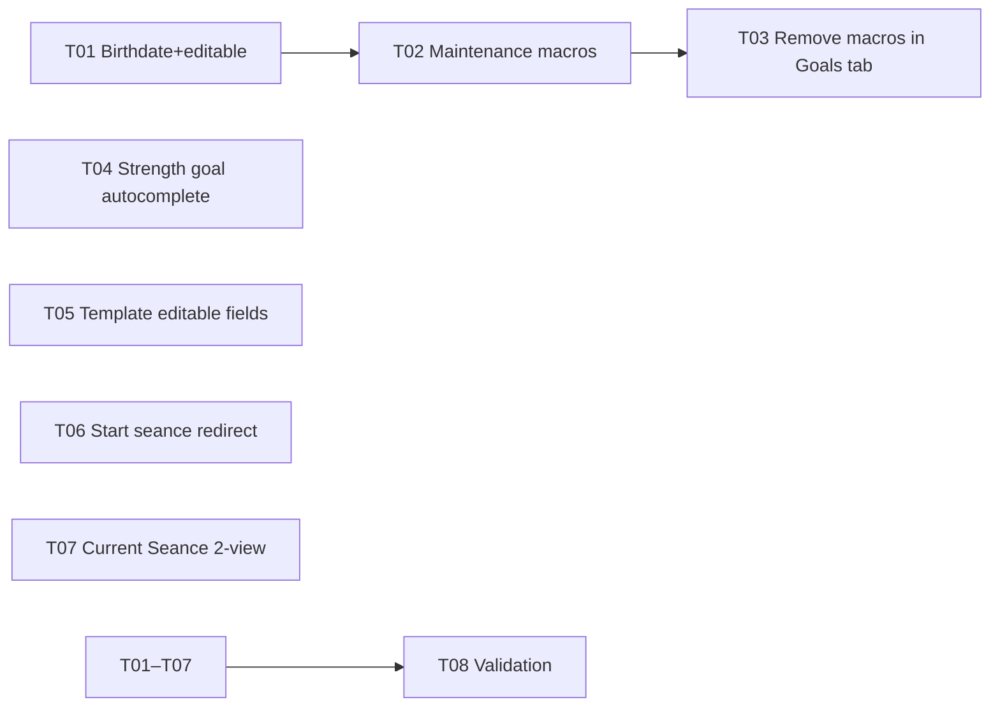

# Plan: post-mvp-polish

Change requests after MVP completion. 8 improvements across profile, goals, dashboard, templates, and seance UX.

---

## Task list

### T01: Profile — birthdate + editable profile (status:done)
- **Goal**: Replace `UserProfile.age` with `birthDate` (computed age). Make weight, height, birthdate, sex, and activity level editable via the existing profile dialog.
- **Files**: `lib/src/models/dashboard_models.dart` — `age` → `birthDate` + computed `age` getter. `lib/src/screens/dashboard/dashboard_screen.dart` — `ProfileSetupDialog` now uses date picker instead of age text field, accepts optional `initial` profile for editing, shows "Edit Profile" button when profile exists. `_promptProfileFirst` passes existing profile for editing.
- **Done when**: Profile dialog shows birthdate picker + height/weight/sex/activity. Reopening dialog shows saved values. TDEE uses computed age.
- **Verification**: `flutter analyze` — 0 issues; `flutter test` — 6/6 passed.

### T02: Overview — show maintenance macros when no bodyweight goal (status:done)
- **Goal**: When user has a profile but no bodyweight goal, show **maintenance calories** (TDEE-based) in the DailyNutritionCard instead of zero.
- **Files**: `lib/src/providers/dashboard_providers.dart` — `computedMacrosProvider` now checks profile and goal separately: if profile exists but no goal, computes maintenance macros (1.8g/kg protein, 25% fat, carbs remainder). Extracted shared `_computeMacros` helper.
- **Done when**: Profile set, no goal → Overview shows maintenance macros. Goal set → shows goal-derived macros.
- **Verification**: `flutter analyze` — 0 issues; `flutter test` — 6/6 passed.

### T03: Goals tab — remove macros display from bodyweight goal card (status:done)
- **Goal**: Bodyweight goal card in Goals tab should only show goal details (direction, target, date, edit/delete). Remove the computed macros section (Calories/Protein/Carbs/Fat) — already visible in Overview tab.
- **Files**: `lib/src/screens/dashboard/dashboard_screen.dart` — removed `Divider` + 4 `_goalDetailRow` calls from the bodyweight goal card.
- **Done when**: Bodyweight goal card shows direction, target, date — no macro breakdown.
- **Verification**: `flutter analyze` — 0 issues; `flutter test` — 6/6 passed.

### T04: Strength goal dialog — autocomplete for exercise (status:done)
- **Goal**: Replace free-text exercise field in `StrengthGoalDialog` with an `Autocomplete` widget listing built-in exercises.
- **Files**: `lib/src/screens/dashboard/dashboard_screen.dart` — `StrengthGoalDialog` now uses `Autocomplete<ExerciseDefinition>` from the built-in exercise list. Syncs with `_exerciseController` for `_save()`. Previous goals with the same exercise name are excluded from suggestions. Custom exercise names still work via text input. Added imports for `ExerciseDefinition` and `exerciseListProvider`.
- **Done when**: Typing in the exercise field shows matching built-in exercises. Selection fills the field. Custom text still works.
- **Verification**: `flutter analyze` — 0 issues; `flutter test` — 6/6 passed.

### T05: Template exercises — inline editable fields (status:done)
- **Goal**: Replace the static exercise display in `CreateSeanceScreen` (3×8 reps, no edit) with editable inline fields: sets, reps, weight, rest seconds per exercise.
- **Files**: `lib/src/screens/exercise/create_seance_screen.dart` — added `_ExerciseSettingsCard` widget with 4 inline TextFields (sets, reps, weight, rest) per exercise. Real-time `onChanged` callback updates the local `_exercises` list. Remove button preserved.
- **Done when**: Each added exercise shows editable sets/reps/weight/rest fields. Changes persist locally.
- **Verification**: `flutter analyze` — 0 issues; `flutter test` — 6/6 passed.

### T06: Start blank seance — redirect to Current Seance tab (status:done)
- **Goal**: When user taps "Start Blank Seance", automatically navigate to the Current Seance tab (index 2) in the Exercise section.
- **Files**: `lib/src/screens/exercise/exercise_screen.dart` — `startSeance()` call now followed by `DefaultTabController.of(context).animateTo(2)` to redirect to the Current Seance tab.
- **Done when**: Tapping "Start Blank Seance" opens the Current Seance tab.
- **Verification**: `flutter analyze` — 0 issues; `flutter test` — 6/6 passed.

### T07: Current Seance — two views with swipe (status:done)
- **Goal**: Show an **exercise list view** first (list of exercises added + "Add Exercise" section), then when tapping an exercise, show its **sets view** with swipe between exercises. Back button returns to list. "Complete Seance" FAB on last exercise only.
- **Files**: `lib/src/screens/exercise/exercise_screen.dart` — `CurrentSeanceScreen` rewritten with two-state flow: `_selectedExerciseIndex` state toggles between `_buildExerciseListView` (list of added exercises + addable exercises from the full list) and `_buildDetailView` (PageView with swipe between exercises + add sets + summary). AppBar shows back arrow in detail view. FAB visible on list view (when exercises exist) or on last exercise in detail view.
- **Done when**: Landing on Current Seance tab shows an exercise list. Tapping an exercise enters a swipeable detail view. Swiping left/right moves through exercises. A back action returns to the list.
- **Verification**: `flutter analyze` — 0 issues; `flutter test` — 6/6 passed.

### T08: Validation & cleanup (status:done)
- **Completed**: 2026-05-20
- **Goal**: Run `flutter analyze`, `flutter test`, update plan status, sync context.
- **Verification**: `flutter analyze` — No issues found; `flutter test` — 6/6 passed.

## Validation Report

### Commands run
- `flutter analyze` → exit 0 — **No issues found**
- `flutter test` → exit 0 — **6/6 passed**
  - seance_providers_test: 1/1 passed
  - food_providers_test: 2/2 passed
  - widget_test: 3/3 passed
- No temporary scaffolding found

### Success-criteria verification
- [x] T01: Profile birthdate + editable → implemented and verified
- [x] T02: Maintenance macros when no goal → implemented and verified
- [x] T03: Remove macros from Goals tab → implemented and verified
- [x] T04: Strength goal autocomplete → implemented and verified
- [x] T05: Template inline editable fields → implemented and verified
- [x] T06: Start seance redirect to Current Seance tab → implemented and verified
- [x] T07: Current Seance two views with swipe → implemented and verified
- [x] `flutter analyze` — zero issues
- [x] `flutter test` — all pass

### Residual risks
- None identified for this plan. Drift persistence (T09 from unified-roadmap) remains deferred.

---

## Dependency graph

T01-T07 are independent except T02/T03 depend on T01 (profile changes).

---

## Superseded context

This plan extends the work done in `unified-roadmap.md`. See that file for completed features (T01-T11).

---

File: `context/plans/post-mvp-polish.md`
