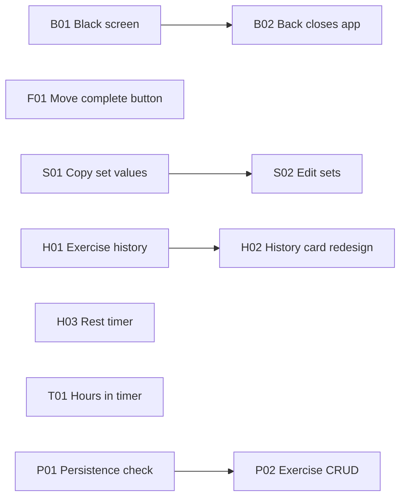

# Plan: quality-round-2

Fixes and improvements collected from user notes. Sorted by priority/type.

---

## Bugs

### B01: Black screen after completing seance (status:done)
- Fixed: all navigation to `/current-seance` now uses `context.push('/current-seance')` (GoRouter route) instead of `Navigator.of(context, rootNavigator: true).push()`. Cancel and complete now use `context.go('/exercise')` to always return to a known page, eliminating the black screen. Also fixes B02 (back closes app).

### B02: Going back from current seance closes the app (status:done)
- Fixed: cancel/complete now navigate to `/exercise` instead of popping the navigator stack. This ensures there is always a destination regardless of navigation history.

---

## Seance Flow & Complete Button

### F01: Move Complete Seance button to bottom of exercise list view (status:todo)
- The FAB is too large and overlaps content. Move the "Complete Seance" button to a persistent bottom bar or a position below the exercise list. Remove the FAB variant from the detail view (the user can swipe through exercises).
- **Files**: `lib/src/screens/exercise/current_seance_screen.dart`
- **Done when**: "Complete Seance" is a visible button at the bottom of the exercise list view, not a FAB. Detail view does not show it.

---

## Exercise Sets

### S01: Previous set values should copy to new set (status:done)
- `AddSetForm` now accepts optional `initialReps` and `initialWeight` parameters. In `_buildDetailView`, these are populated from the last set's values. `didUpdateWidget` updates the controllers when the parent rebuilds with new initial values.

### S02: Edit previous sets (status:done)
- Added `updateSet(exerciseIndex, setIndex, reps, weight)` to `ActiveSeanceNotifier`.
- Set cards in the detail view are now wrapped in `InkWell` — tapping opens an edit dialog with the current reps/weight. Save calls `updateSet` on the provider.

### S04: Set completion tracking & per-set timestamp (status:done)
- `ExerciseSet` now has optional `completedAt` (DateTime) with `isCompleted` getter.
- `addSet()` auto-completes the new set and any previously uncompleted sets in the same exercise.
- Added `toggleSetCompleted(exerciseIndex, setIndex)` to `ActiveSeanceNotifier` — toggles completion on/off for manual checkboxes.
- Detail view shows each set with a checkbox, reps×weight, and HH:mm completion time.
- JSON serialization updated for active seance persistence.

### S03: Add notes/variations to sets (status:idea)
- Some exercises have variations (close-grip, pause reps, Larsen press). Could be solved with notes per set or sub-categories per exercise. Needs design discussion.
- **Outcome**: Deferred to future discussion.

---

## History & Metrics

### H01: Exercise history view (status:done)
- Added `ExerciseHistoryScreen` — shows completed seances containing the selected exercise. Each entry displays the date, number of sets, per-set reps×weight, and the best set (by weight). Accessed by tapping any exercise in the exercise list.
- **Files**: `lib/src/screens/exercise/exercise_history_screen.dart` (new), `lib/src/screens/exercise/exercise_screen.dart`

### H02: Redesign seance history cards (status:done)
- Completely redesigned `_SeanceHistoryCard`: date header (e.g. "Monday, May 23, 2026"), seance name, per-exercise rows showing set count and summary (e.g. "10×60, 8×65"), duration footer. "Create template" moved to a bottom sheet (⋮ button).
- **Files**: `lib/src/screens/exercise/exercise_screen.dart`

### H03: Rest timer in notification (status:done)
- Added `_restStartedAtKey` — when a set is added, the foreground service saves the current timestamp. The background `SeanceTaskHandler` reads it and shows "Rest: Xs remaining" in the notification until it hits 0, then falls back to the elapsed time.
- `ActiveSeanceNotifier.addSet()` now calls `SeanceForegroundService.instance.restSet(90)` after each set.
- Rest period defaults to 90 seconds.
- **Files**: `lib/src/services/seance_foreground_service.dart`, `lib/src/providers/exercise_providers.dart`

---

## Timer

### T01: Timer shows hours instead of +60 minutes (status:todo)
- At 61 minutes the display shows `61:00` instead of `01:01:00`. Fix: show hours when elapsed exceeds 60 minutes.
- **Files**: `lib/src/screens/exercise/current_seance_screen.dart` (`TimerWidget`), `lib/src/widgets/appbar_seance_indicator.dart` (`SeanceFloatingPill`)
- **Done when**: Timer shows `1:01:00` at 61 minutes instead of `61:00`.

---

## Polish

### P01: Persistence verification (status:todo)
- User reports "persistence doesn't work". Check: exercises survive restart (T05 ✓). Ingredients should persist (T06). Profile and goals should persist (T08). Verify each and fix gaps.
- **Done when**: All data types verified to survive app restart.

### P02: Create exercises & view info (status:todo)
- Currently exercises are seed-only. Add ability to create custom exercises and view exercise details (name, category, personal bests).
- **Files**: `lib/src/screens/exercise/exercise_screen.dart` (`ExercisesListTab`)
- **Done when**: User can add a custom exercise. Tapping an exercise shows its details.

### P03: Rename "Ingredients" (status:idea)
- User notes "Ingredients" may not be the best term. "Foods" or "Items" could be more natural. Needs UX discussion.
- **Outcome**: Deferred to future discussion.

---

## Dependency graph

---

File: `context/plans/quality-round-2.md`
