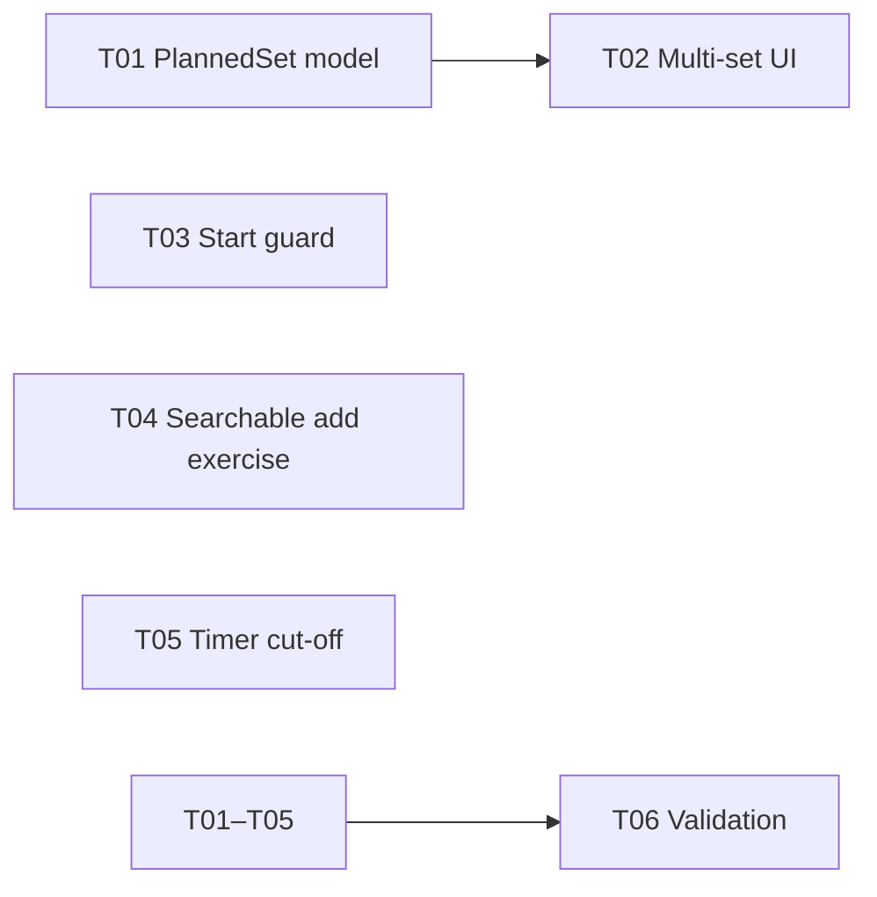

# Plan: template-sets-seance-guard

Follow-up UX improvements after post-MVP polish.

---

## Task list

### T01: Template model — `ExerciseTemplate` multi-set support (status:done)
- **Goal**: Replace single `sets`/`reps`/`plannedWeightKg` with `List<PlannedSet>` to allow per-set planning.
- **Files**: `lib/src/models/seance_models.dart` — new `PlannedSet` class (reps, weightKg?), `ExerciseTemplate.plannedSets: List<PlannedSet>`, `totalSets` getter, updated `copyWith`. `lib/src/providers/exercise_providers.dart` — `startSeanceFromTemplate` maps `plannedSets` → `ExerciseSet`s. `lib/src/screens/exercise/exercise_screen.dart` — `_SeanceHistoryCard` creates templates from seance history using `PlannedSet`s. `lib/src/screens/exercise/create_seance_screen.dart` — temporary display-only list (T02 adds proper UI).
- **Done when**: `ExerciseTemplate` stores `List<PlannedSet>`. Existing consumers compile.
- **Verification**: `flutter analyze` — 0 issues; `flutter test` — 6/6 passed.

### T02: Template UI — multi-set row editor (status:done)
- **Goal**: In `CreateSeanceScreen`, replace the single sets/reps/weight fields with a dynamic list of set rows. Each row has reps + weight. Add/remove rows per exercise.
- **Files**: `lib/src/screens/exercise/create_seance_screen.dart` — `_ExerciseSettingsCard` now shows editable per-set rows with reps × weight fields + remove button. "Add set" button adds a new row. Rest field remains. `_SetRowControllers` helper class manages per-row controllers.
- **Done when**: Adding an exercise shows it with default planned sets. User can add/remove/edit individual set rows.
- **Verification**: `flutter analyze` — 0 issues; `flutter test` — 6/6 passed.

### T03: Start seance — guard against overwriting active seance (status:done)
- **Goal**: If a seance is already active, show a confirmation dialog before replacing it.
- **Files**: `lib/src/screens/exercise/exercise_screen.dart` — added `confirmReplaceSeance()` top-level helper. "Start Blank Seance" and `_TemplateCard` start check for active seance first. `lib/src/screens/exercise/seance_library_screen.dart` — start button shows inline dialog when active seance exists.
- **Done when**: Tapping "Start Blank Seance" or a template card while seance is active shows a popup. "Cancel" dismisses. "Confirm" cancels current and starts new.
- **Verification**: `flutter analyze` — 0 issues; `flutter test` — 6/6 passed.

### T04: Current Seance — searchable add exercise (status:done)
- **Goal**: The "Add Exercise" list in the current seance's exercise list view should have a search text field.
- **Files**: `lib/src/screens/exercise/exercise_screen.dart` — `_exerciseSearchController` added to `_CurrentSeanceScreenState`. "Add Exercise" section now has a search `TextField` that filters the exercise list.
- **Done when**: Add Exercise section has a search field. Typing filters the list.
- **Verification**: `flutter analyze` — 0 issues

### T05: Timer — fix cut-off display (status:done)
- **Goal**: The timer display in `CurrentSeanceScreen` AppBar was visually cut off. Ensure adequate padding and font size.
- **Files**: `lib/src/screens/exercise/exercise_screen.dart` — `TimerWidget` now uses `fontSize: 18` with bold weight and horizontal padding. `lib/src/widgets/appbar_seance_indicator.dart` — reduced padding/icon size for tighter fit.
- **Done when**: Timer text displays fully with no clipping.
- **Verification**: `flutter analyze` — 0 issues

### T06: Validation & cleanup (status:done)
- **Completed**: 2026-05-20
- **Verification**: `flutter analyze` — No issues found; `flutter test` — 6/6 passed.

## Validation Report

### Commands run
- `flutter analyze` → exit 0 — **No issues found**
- `flutter test` → exit 0 — **6/6 passed**
- No temporary scaffolding found

### Success-criteria verification
- [x] T01: `PlannedSet` model + multi-set `ExerciseTemplate` → done
- [x] T02: Multi-set editable row UI with add/remove → done
- [x] T03: Start seance guard with confirmation dialog → done
- [x] T04: Current Seance searchable add exercise → done
- [x] T05: Timer display cut-off fix → done
- [x] `flutter analyze` — zero issues
- [x] `flutter test` — all pass

### Residual risks
- None identified.

---

## Dependency graph

---

File: `context/plans/template-sets-seance-guard.md`
