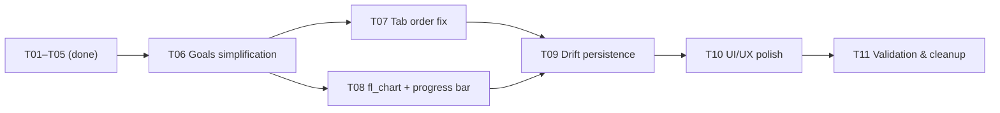

# Unified Roadmap: fitfat MVP → Polish

Last updated: 2026-05-20

## Change Summary

Harmonize two existing plans (`mvp-calorie-exercise-tracker.md` and `seance-dashboard-plan.md`) into a single sequential roadmap. **All remaining features are completed first** (Diet CRUD, Exercise seance flow, Goals simplification, Charts, Persistence), then **UI/UX polish** is applied as a final pass.

This plan supersedes both previous plans. Tasks already verified as implemented in code are marked `done` and carried forward with evidence. Only genuinely incomplete items appear as executable tasks.

## Success Criteria

1. Bottom navigation tabs: Diet — Dashboard — Exercise (Dashboard default at launch).
2. Diet tab: full CRUD for meals and ingredients (add, edit, delete).
3. Exercise tab: exercises list (selection only), seance lifecycle (start/stop, add sets with reps/weight, timer, rest, summary).
4. Seance: template create/edit/clone/start, background timer with notification, AppBar indicator.
5. Dashboard: simplified goals ("Gain Strength" or "Change Body Weight") with computed macros, nutrition summary, strength progression line chart (fl_chart) + goal progress bar, bodyweight trend chart.
6. All data persists across app restarts (Drift/SQLite).
7. UI/UX polish: consistent styling, loading/empty/error states, responsive layout.
8. `flutter analyze` clean; tests pass.

## Constraints & Non-goals

- **Local-first**: fully offline. No cloud sync, no auth, no multi-user.
- **No barcode scanner** (deferred to future iteration).
- **No pedometer** (deferred to future iteration).
- **No AI meal recognition** (out of scope).
- **No social features** (no sharing, leaderboards, friends).
- **No iOS background-timer parity** — Android foreground service is primary; iOS uses best-effort with documented limits.

## Architecture Decisions (carried forward)

| Decision | Choice | Rationale |
|----------|--------|-----------|
| State management | Riverpod (manual, no codegen) | Established, works with Flutter SDK constraints |
| Navigation | go_router + StatefulShellRoute | Deep linking, persistent tab state |
| Charts | fl_chart | Mature, pure Dart, already in pubspec |
| Local DB | Drift (SQLite) | Type-safe ORM, codegen, offline |
| Background timer | flutter_foreground_task | Unified cross-platform plugin |
| IDs | uuid | Works with Drift later |

---

## Phase 1 — Complete All Remaining Features

### T01: Root project scaffold, shell & routing (status:done)
- **Evidence**: `lib/main.dart`, `lib/src/app.dart`, `lib/src/app_theme.dart`, `lib/src/router/app_router.dart` (GoRouter with 3-tab StatefulShellRoute)
- **Verification**: `flutter analyze` clean; app launches with 3-tab shell

### T02: Diet tab — food logging & CRUD (status:done)
- **Evidence**: `lib/src/screens/food/` (MealsTab, AddMealScreen, CustomIngredientScreen, FoodEntryCard), `lib/src/providers/food_providers.dart` (IngredientListNotifier, MealLogNotifier with full add/update/delete), `lib/src/providers/food_providers.dart` (seed data), `lib/src/models/food_models.dart`
- **Verification**: Manual — add/edit/delete meal and ingredient; list updates immediately

### T03: Exercise — exercises list & seance flow (status:done)
- **Evidence**: `lib/src/screens/exercise/exercise_screen.dart` (ExercisesListTab, SeancesHistoryTab, CurrentSeanceScreen with timer, add-set form, complete flow), `lib/src/providers/exercise_providers.dart` (ActiveSeanceNotifier with startSeance/addExercise/addSet/completeSeance, SeanceHistoryNotifier, seeded exercises), `lib/src/models/exercise_models.dart` (ExerciseDefinition, ExerciseSet, ExerciseEntry, Seance)
- **Verification**: Manual — start blank seance, add exercises, add sets with reps/weight, complete seance, see history

### T04: Current Seance lifecycle & background timer (status:done)
- **Tracks**: seance-dashboard-plan T01
- **Evidence**: `lib/src/services/seance_foreground_service.dart`, `lib/src/widgets/appbar_seance_indicator.dart`, `lib/src/providers/exercise_providers.dart` (foreground-service hooks in startSeance/completeSeance), platform config (Android `FOREGROUND_SERVICE` permission, iOS plist/AppDelegate)
- **Verification**: Start seance → switch apps → notification shows elapsed time; AppBar indicator visible on all tabs

### T05: Seance template system (Create/Edit/Clone/Start) (status:done)
- **Tracks**: seance-dashboard-plan T02 (remaining items)
- **Evidence**: `lib/src/screens/exercise/seance_library_screen.dart` (template list with start/edit/clone/delete), `lib/src/screens/exercise/create_seance_screen.dart` (create/edit template), `lib/src/providers/seance_providers.dart` (TemplateListNotifier with CRUD + clone, ActiveSeancePlanNotifier), `lib/src/repositories/seance_repository.dart` + `in_memory_seance_repository.dart`
- **Verification**: Create template → start from template → exercises pre-populated; clone template → edit → save

### T06: Goals simplification — "Gain Strength" / "Change Body Weight" (status:done)
- **Completed**: 2026-05-20
- **Tracks**: seance-dashboard-plan T07, mvp T07 (goals part)
- **Goal**: Replace the current multi-field macro goals editor with two high-level goal types. Compute calories/macros in the background.
- **Boundaries (in/out of scope)**:
  - In — new `Goal` sealed class (`StrengthGoal | BodyWeightGoal`), user profile (age/sex/height/weight/activity), TDEE (Mifflin-St Jeor) + macro computation, simplified UI, goal-type selector dialog, profile setup dialog.
  - Out — nutrition coaching, meal plans, custom macro editing (macros are derived from goal type, not user-editable).
- **Files changed**:
  - `lib/src/models/dashboard_models.dart` — added `UserProfile`, `Sex`, `ActivityLevel`, sealed `Goal` class (`StrengthGoal`, `BodyWeightGoal`), `BodyWeightDirection`, `ComputedMacros`. Retained `NutritionGoal` for backward compat.
  - `lib/src/providers/dashboard_providers.dart` — added `userProfileProvider`, rewritten `goalProvider` → `Goal?`, added `computedMacrosProvider` with TDEE computation, added `legacyNutritionGoalProvider` for backward compat.
  - `lib/src/screens/dashboard/dashboard_screen.dart` — replaced `GoalsCard`/`GoalsEditDialog` with new `GoalsCard` showing goal type + computed macros, added `GoalTypeSelectorDialog` (segmented button + type-specific fields), added `ProfileSetupDialog` (age/sex/height/weight/activity), `DailyNutritionCard` now reads from `computedMacrosProvider`.
- **Done when**: Goals screen shows two choices. Selecting "Gain Strength" prompts for exercise + target weight (kg). Selecting "Change Body Weight" prompts for target weight (kg), target date, direction (gain/lose/maintain). Dashboard shows the simplified goal + computed macros.
- **Verification**: `flutter analyze` — 0 issues in touched files; `flutter test` — 6/6 passed.

### T07: Tab order fix — Dashboard default, Diet — Dashboard — Exercise order (status:todo)
- **Tracks**: seance-dashboard-plan T06
- **Goal**: Set bottom nav order to Diet — Dashboard — Exercise. Change initial route to `/dashboard`.
- **Boundaries**: In — reorder stateful shell branches, change `initialLocation`. Out — any other routing changes.
- **Done when**: Bottom nav shows Diet / Dashboard / Exercise. App opens on Dashboard.
- **Verification**: Launch app → Dashboard is shown; tap tabs → correct screens

### T08: Strength trend chart — fl_chart line chart + goal progress bar (status:todo)
- **Tracks**: seance-dashboard-plan T08
- **Goal**: Replace the custom bar-chart strength display with an fl_chart `LineChart` for progression over 7/30/90 days. Add a progress bar showing % toward strength goal (if goal exists).
- **Boundaries**: In — fl_chart LineChart widget, period selector (existing), progress bar. Out — other chart types, chart export/share.
- **Depends on**: T06 (goals model with target weight)
- **Done when**: Strength trend shows a proper line chart with selectable period; progress bar shows % to goal.
- **Verification**: `flutter analyze`; visual QA — line chart renders, progress bar updates when goal changes

### T09: Data persistence — Drift DB migration (status:todo)
- **Tracks**: seance-dashboard-plan T09, mvp Phase 2
- **Goal**: Define Drift schema for seances/exercises/sets/templates/goals/diet. Replace in-memory providers with DB-backed streaming providers.
- **Boundaries**:
  - In — Drift tables, DAOs, migration from mock data, provider adapters.
  - Out — barcode scanner, pedometer, cloud sync.
- **Done when**: All data persists across app restarts. Existing UI works with minimal changes.
- **Verification**: `flutter analyze`; start app → add data → kill app → reopen → data present

---

## Phase 2 — UI/UX Improvement Pass

### T10: UI/UX polish — consistency, states, responsiveness (status:todo)
- **Goal**: Apply a cohesive polish pass across all screens: consistent spacing/typography/widgets, loading/empty/error states, responsive layout for different screen sizes, dark mode verification.
- **Boundaries**:
  - In — styling consistency, state handling (loading spinners, empty states, error banners), layout responsiveness, dark mode visual QA.
  - Out — new features, animation overhauls, design-system rewrite.
- **Done when**: Every screen handles loading/empty/error gracefully; layout works on phone and tablet; dark mode has no broken contrast.
- **Verification**: `flutter analyze`; manual — navigate every screen in light + dark mode; rotate device

### T11: Validation, cleanup & context sync (status:todo)
- **Tracks**: seance-dashboard-plan T10
- **Goal**: Final validation pass: full `flutter analyze`, run all widget tests, smoke-test critical journeys (start seance, clone template, dashboard goals, chart rendering). Remove obsolete plan files. Sync context to current state.
- **Boundaries**: In — analyzer, tests, smoke tests, context file updates, removal of superseded plan files. Out — new features, bug fixes beyond in-scope regressions.
- **Done when**: `flutter analyze` zero warnings; tests pass; superseded plan files removed; context files represent current state.
- **Verification**: `flutter analyze`; `flutter test`; manual smoke test of all critical journeys

---

## Dependency graph

## Previously completed work (carried forward from earlier plans)

| Area | What's done | Files |
|------|------------|-------|
| Scaffold | Flutter project, folder structure, pubspec deps, GoRouter skeleton | `lib/main.dart`, `lib/src/app.dart`, `lib/src/app_theme.dart`, `lib/src/router/app_router.dart` |
| Diet | Full CRUD meals + ingredients, search, custom ingredient creation, seed data | `lib/src/screens/food/`, `lib/src/providers/food_providers.dart`, `lib/src/models/food_models.dart` |
| Exercise | Exercise list, seance start/stop/add exercises/add sets/timer/complete, history | `lib/src/screens/exercise/exercise_screen.dart`, `lib/src/providers/exercise_providers.dart`, `lib/src/models/exercise_models.dart` |
| Background timer | Foreground service (Android) + iOS best-effort, persistent notification, AppBar indicator | `lib/src/services/seance_foreground_service.dart`, `lib/src/widgets/appbar_seance_indicator.dart` |
| Templates | Create/edit/clone/start from template, SeanceLibraryScreen, repository pattern | `lib/src/screens/exercise/seance_library_screen.dart`, `lib/src/screens/exercise/create_seance_screen.dart`, `lib/src/providers/seance_providers.dart`, `lib/src/repositories/` |
| Dashboard | Daily nutrition card, goals card (old multi-field model), strength trend (custom bar), bodyweight trend | `lib/src/screens/dashboard/dashboard_screen.dart`, `lib/src/providers/dashboard_providers.dart`, `lib/src/models/dashboard_models.dart` |

## Superseded plans

Once this plan is accepted, the following plan files should be marked as superseded (or removed in T11):
- `context/plans/mvp-calorie-exercise-tracker.md` — superseded by this unified roadmap
- `context/plans/seance-dashboard-plan.md` — superseded by this unified roadmap

## Next steps

1. Review this unified roadmap with the user for approval.
2. Begin implementing T06 (Goals simplification).
3. Continue through T07 → T08 → T09 → T10 → T11.

---

File path: `context/plans/unified-roadmap.md`
