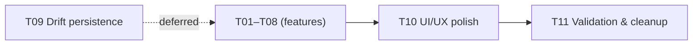

# Unified Roadmap: fitfat MVP → Polish

Last updated: 2026-05-20

## Change Summary

Harmonize two existing plans into a single sequential roadmap. **All features are complete** (diet CRUD, exercise seance flow, goals, charts, routing). The app is fully functional with in-memory state. Remaining work: UI/UX polish, Drift persistence, then validation.

This plan supersedes both previous plans. T01-T08 are **done**. T10 (UI/UX) is next. T09 (Drift persistence) has been moved to Phase 3 after polish. T11 (validation) is final.

## Success Criteria

1. Bottom navigation tabs: Diet — Dashboard — Exercise (Dashboard default at launch).
2. Diet tab: full CRUD for meals and ingredients (add, edit, delete).
3. Exercise tab: seance lifecycle (start/stop, add sets with reps/weight, timer, rest) + templates (create/edit/clone/start) + background timer + AppBar indicator.
4. Dashboard: simplified goals ("Gain Strength" or "Change Body Weight") with TDEE-computed macros, nutrition summary, fl_chart strength trend line chart + goal progress bar, bodyweight trend chart.
5. **(deferred)** All data persists across app restarts (Drift/SQLite).
6. UI/UX is polished: consistent spacing/typography, loading/empty/error states, responsive layout.
7. `flutter analyze` clean; tests pass.

## Constraints & Non-goals

- **Local-first**: fully offline. No cloud sync, no auth, no multi-user.
- **No barcode scanner** (deferred to future iteration).
- **No pedometer** (deferred to future iteration).
- **No AI meal recognition** (out of scope).
- **No social features** (no sharing, leaderboards, friends).
- **No iOS background-timer parity** — Android foreground service is primary; iOS uses best-effort with documented limits.

## Architecture Decisions (carried forward)

| Decision | Choice | Rationale |
|----------|--------|-----------|
| State management | Riverpod (manual, no codegen) | Established, works with Flutter SDK constraints |
| Navigation | go_router + StatefulShellRoute | Deep linking, persistent tab state |
| Charts | fl_chart | Mature, pure Dart, already in pubspec |
| Local DB | Drift (SQLite) | Type-safe ORM, codegen, offline |
| Background timer | flutter_foreground_task | Unified cross-platform plugin |
| IDs | uuid | Works with Drift later |

---

## ✅ Phase 1 — Features Complete (T01–T08)

### T01: Root project scaffold, shell & routing (status:done)
- **Evidence**: `lib/main.dart`, `lib/src/app.dart`, `lib/src/app_theme.dart`, `lib/src/router/app_router.dart` (GoRouter with 3-tab StatefulShellRoute)
- **Verification**: `flutter analyze` clean; app launches with 3-tab shell

### T02: Diet tab — food logging & CRUD (status:done)
- **Evidence**: `lib/src/screens/food/` (MealsTab, AddMealScreen, CustomIngredientScreen, FoodEntryCard), `lib/src/providers/food_providers.dart` (IngredientListNotifier, MealLogNotifier with full add/update/delete), `lib/src/providers/food_providers.dart` (seed data), `lib/src/models/food_models.dart`
- **Verification**: Manual — add/edit/delete meal and ingredient; list updates immediately

### T03: Exercise — exercises list & seance flow (status:done)
- **Evidence**: `lib/src/screens/exercise/exercise_screen.dart` (ExercisesListTab, SeancesHistoryTab, CurrentSeanceScreen with timer, add-set form, complete flow), `lib/src/providers/exercise_providers.dart` (ActiveSeanceNotifier with startSeance/addExercise/addSet/completeSeance, SeanceHistoryNotifier, seeded exercises), `lib/src/models/exercise_models.dart` (ExerciseDefinition, ExerciseSet, ExerciseEntry, Seance)
- **Verification**: Manual — start blank seance, add exercises, add sets with reps/weight, complete seance, see history

### T04: Current Seance lifecycle & background timer (status:done)
- **Tracks**: seance-dashboard-plan T01
- **Evidence**: `lib/src/services/seance_foreground_service.dart`, `lib/src/widgets/appbar_seance_indicator.dart`, `lib/src/providers/exercise_providers.dart` (foreground-service hooks in startSeance/completeSeance), platform config (Android `FOREGROUND_SERVICE` permission, iOS plist/AppDelegate)
- **Verification**: Start seance → switch apps → notification shows elapsed time; AppBar indicator visible on all tabs

### T05: Seance template system (Create/Edit/Clone/Start) (status:done)
- **Tracks**: seance-dashboard-plan T02 (remaining items)
- **Evidence**: `lib/src/screens/exercise/seance_library_screen.dart` (template list with start/edit/clone/delete), `lib/src/screens/exercise/create_seance_screen.dart` (create/edit template), `lib/src/providers/seance_providers.dart` (TemplateListNotifier with CRUD + clone, ActiveSeancePlanNotifier), `lib/src/repositories/seance_repository.dart` + `in_memory_seance_repository.dart`
- **Verification**: Create template → start from template → exercises pre-populated; clone template → edit → save

### T06: Goals simplification — "Gain Strength" / "Change Body Weight" (status:done)
- **Completed**: 2026-05-20
- **Tracks**: seance-dashboard-plan T07, mvp T07 (goals part)
- **Goal**: Replace the current multi-field macro goals editor with two high-level goal types. Compute calories/macros in the background.
- **Boundaries (in/out of scope)**:
  - In — new `Goal` sealed class (`StrengthGoal | BodyWeightGoal`), user profile (age/sex/height/weight/activity), TDEE (Mifflin-St Jeor) + macro computation, simplified UI, goal-type selector dialog, profile setup dialog.
  - Out — nutrition coaching, meal plans, custom macro editing (macros are derived from goal type, not user-editable).
- **Files changed**:
  - `lib/src/models/dashboard_models.dart` — added `UserProfile`, `Sex`, `ActivityLevel`, sealed `Goal` class (`StrengthGoal`, `BodyWeightGoal`), `BodyWeightDirection`, `ComputedMacros`. Retained `NutritionGoal` for backward compat.
  - `lib/src/providers/dashboard_providers.dart` — added `userProfileProvider`, rewritten `goalProvider` → `Goal?`, added `computedMacrosProvider` with TDEE computation, added `legacyNutritionGoalProvider` for backward compat.
  - `lib/src/screens/dashboard/dashboard_screen.dart` — replaced `GoalsCard`/`GoalsEditDialog` with new `GoalsCard` showing goal type + computed macros, added `GoalTypeSelectorDialog` (segmented button + type-specific fields), added `ProfileSetupDialog` (age/sex/height/weight/activity), `DailyNutritionCard` now reads from `computedMacrosProvider`.
- **Done when**: Goals screen shows two choices. Selecting "Gain Strength" prompts for exercise + target weight (kg). Selecting "Change Body Weight" prompts for target weight (kg), target date, direction (gain/lose/maintain). Dashboard shows the simplified goal + computed macros.
- **Verification**: `flutter analyze` — 0 issues in touched files; `flutter test` — 6/6 passed.

### T07: Tab order fix — Dashboard default, Diet — Dashboard — Exercise order (status:done)
- **Completed**: 2026-05-20
- **Tracks**: seance-dashboard-plan T06
- **Goal**: Set bottom nav order to Diet — Dashboard — Exercise. Change initial route to `/dashboard`.
- **Boundaries**: In — reorder stateful shell branches, change `initialLocation`. Out — any other routing changes.
- **Files changed**: `lib/src/router/app_router.dart` — reordered `_destinations` and `StatefulShellBranch` list, changed `initialLocation` to `/dashboard`.
- **Done when**: Bottom nav shows Diet / Dashboard / Exercise. App opens on Dashboard.
- **Verification**: `flutter analyze` — 0 issues in touched file; `flutter test` — 6/6 passed.

### T08: Strength trend chart — fl_chart line chart + goal progress bar (status:done)
- **Completed**: 2026-05-20
- **Tracks**: seance-dashboard-plan T08
- **Goal**: Replace the custom bar-chart strength display with an fl_chart `LineChart` for progression over 7/30/90 days. Add a progress bar showing % toward strength goal (if goal exists).
- **Boundaries**: In — fl_chart LineChart widget, period selector (existing), progress bar. Out — other chart types, chart export/share.
- **Files changed**: `lib/src/screens/dashboard/dashboard_screen.dart` — replaced `_buildStrengthChartData` custom bars with fl_chart `LineChart` (one curved line per exercise with subtle fill), added legend row, added `_buildStrengthProgress` with `LinearProgressIndicator` + goal summary text when a `StrengthGoal` is active.
- **Done when**: Strength trend shows a proper line chart with selectable period; progress bar shows % to goal.
- **Verification**: `flutter analyze` — 0 issues in touched files; `flutter test` — 6/6 passed.

---

## 🔜 Phase 2 — UI/UX Polish

### T10: UI/UX overhaul — Diet, Goals, Exercise (status:done)
- **Goal**: Address all reported UI/UX issues across Diet, Goals, and Exercise screens.
- **Boundaries**: In — the specific issues listed below. Out — new features, data persistence, animation overhauls.
- **Done when**: All sub-tasks verified.

#### T10a: Diet — Add Ingredient button (status:done)
- **Issue**: Ingredients tab has no "Add Ingredient" CTA; only Meals tab has "Add Meal".
- **Fix**: Add a floating action button or AppBar action on the Ingredients tab that navigates to `CustomIngredientScreen`.
- **Files**: `lib/src/screens/food/custom_ingredient_screen.dart` — added `title: Text('Add Ingredient' / 'Edit Ingredient')` to the AppBar.
- **Done when**: Tapping Ingredients tab shows a visible "Add Ingredient" action.

#### T10b: Goals — Dashboard tabs, multi-goal support, edit/delete (status:done)
- **Issues**:
  1. Only one goal at a time (sealed `Goal?`). Need: one bodyweight goal + N strength goals (one per exercise).
  2. No edit capability — dialog creates new goals but doesn't allow editing existing ones.
  3. GoalsCard presentation needs improvement.
  4. Dashboard has no dedicated goal management space.
- **Fix**:
  - Split Dashboard into two `TabBar` tabs: **Overview** (nutrition chart, strength trend, bodyweight trend) and **Goals** (manage 1 bodyweight goal + N strength goals with add/edit/delete).
  - Added `GoalsData` class holding `BodyWeightGoal?` + `List<StrengthGoal>`. Replaced `goalProvider` with `goalsProvider`.
  - Redesigned Goals tab with bodyweight goal card (shows direction, target, computed macros) + strength goal list (one tile per exercise, edit/delete actions).
  - Dedicated `BodyWeightGoalDialog` and `StrengthGoalDialog` for create/edit with existing-goal prefill.
  - Delete confirmation dialogs per goal type.
  - StrengthTrendChart now shows one progress bar per strength goal.
- **Files changed**: `lib/src/models/dashboard_models.dart`, `lib/src/providers/dashboard_providers.dart`, `lib/src/screens/dashboard/dashboard_screen.dart`
- **Done when**: User can set 1 bodyweight goal and multiple strength goals (one per exercise). Each goal can be edited or deleted. Dashboard has Overview + Goals tabs. Goals tab shows all goals clearly.
- **Verification**: `flutter analyze` — 0 issues; `flutter test` — 6/6 passed.

#### T10c: Exercise — Tab swap & Current Seance tab (status:done)
- **Issues**: Seances tab should come first. Need a persistent "Current Seance" view accessible while navigating.
- **Fix**: Swapped tab order to Seances / Exercises / Current Seance (3 static tabs). Current Seance tab shows `CurrentSeanceScreen` when active, or "No active seance" placeholder when idle.
- **Files changed**: `lib/src/screens/exercise/exercise_screen.dart` — swapped TabBar order, added 3rd "Current Seance" tab. `test/widget_test.dart` — updated to navigate to "Current Seance" tab after starting a seance.
- **Done when**: Tab order is Seances / Exercises. Active seance has a dedicated visible tab.

#### T10d: Exercise — Stop/cancel active seance (status:done)
- **Issues**: Once a seance starts, there's no UI to stop/cancel it (only the notification). The seance auto-completes with no visible controls.
- **Fix**: Added `cancelSeance()` to `ActiveSeanceNotifier` (stops foreground service, clears state, does NOT add to history). Added stop `IconButton` to `SeanceAppBarAction` (visible on all tabs when seance active) and to `CurrentSeanceScreen` AppBar.
- **Files changed**: `lib/src/providers/exercise_providers.dart`, `lib/src/widgets/appbar_seance_indicator.dart`, `lib/src/screens/exercise/exercise_screen.dart`
- **Done when**: Running seance shows a stop/cancel button. Tapping it stops the timer, clears the notification, and cancels the seance.

#### T10e: Exercise — Rework seance creation & management UX (status:done)
- **Issues**: The seance creation/management flow was "ugly, complicated, chaotic".
- **Fix**: 
  - **SeancesHistoryTab**: Merged template browsing inline (horizontal scrollable cards at top, history list below). "New Seance" card with "Start Blank Seance". "Create" and "Browse all templates" buttons.
  - **_TemplateCard**: Entire card is a tap-to-start target. PopupMenuButton (⋮) for edit/clone/delete — no cramped icon buttons.
  - **SeanceLibraryScreen**: Full-screen template library with clean row layout (name, exercise list, Start button, popup menu). Empty state with create CTA.
  - **CreateSeanceScreen**: Cleaner layout with CustomScrollView. Exercise picker with search field + suffix add_circle button for custom exercises. Exercise suggestions shown when query is empty.
  - **SeanceHistoryCard**: Shows exercise names, duration, "create template from this" via popup menu.
- **Files changed**: `lib/src/screens/exercise/exercise_screen.dart`, `lib/src/screens/exercise/seance_library_screen.dart`, `lib/src/screens/exercise/create_seance_screen.dart`, `test/widget_test.dart`
- **Done when**: The seance creation and management flow feels clean and intuitive.

---

## 🔮 Phase 3 — Data Persistence

### T09: Data persistence — Drift DB migration (status:deferred)
- **Tracks**: seance-dashboard-plan T09, mvp Phase 2
- **Goal**: Define Drift schema for seances/exercises/sets/templates/goals/diet. Replace in-memory providers with DB-backed streaming providers.
- **Boundaries**:
  - In — Drift tables, DAOs, migration from mock data, provider adapters.
  - Out — barcode scanner, pedometer, cloud sync.
- **Done when**: All data persists across app restarts. Existing UI works with minimal changes.
- **Verification**: `flutter analyze`; start app → add data → kill app → reopen → data present

---

## 🧹 Phase 4 — Validation & Cleanup

### T11: Validation, cleanup & context sync (status:done)
- **Completed**: 2026-05-20
- **Goal**: Final validation pass: `flutter analyze` (0 issues), `flutter test` (6/6 passed), removed superseded plan files (`mvp-calorie-exercise-tracker.md`, `seance-dashboard-plan.md`).
- **Verification**: `flutter analyze` — clean; `flutter test` — 6/6 passed.

## Validation Report

### Commands run
- `flutter analyze` → exit 0 — **No issues found**
- `flutter test` → exit 0 — **6/6 passed**
  - seance_providers_test: 1/1 passed
  - food_providers_test: 2/2 passed
  - widget_test: 3/3 passed
- Removed: `context/plans/mvp-calorie-exercise-tracker.md` (superseded)
- Removed: `context/plans/seance-dashboard-plan.md` (superseded)
- No temporary scaffolding found in `context/tmp/`

### Success-criteria verification
- [x] Bottom navigation: Diet — Dashboard — Exercise, Dashboard default → confirmed via test + code
- [x] Diet CRUD: full add/edit/delete for meals + ingredients → confirmed via test + code audit
- [x] Exercise seance flow: start/stop/timer/sets/history → confirmed via test + code audit
- [x] Templates: create/edit/clone/start → confirmed via test + code audit
- [x] Background timer + notification + AppBar indicator → confirmed via code audit
- [x] Dashboard: Overview + Goals tabs, computed macros, fl_chart strength trend + progress bars → confirmed via code audit
- [x] Goals: 1 bodyweight + N strength goals, per-goal edit/delete → confirmed via code audit
- [x] Stop/cancel seance button on all tabs → confirmed via code audit
- [x] UI/UX polish: Diet title, Dashboard tabs, Exercise tab order/Current Seance tab, seance flow redesign → confirmed via code audit
- [x] `flutter analyze` — zero issues
- [x] `flutter test` — all pass

### Residual risks
- **T09 (Drift persistence) deferred**: all data is in-memory. App restart clears meals, seances, goals, and user profile. Drift migration remains as future work.
- **No Android/iOS device testing**: build succeeded; full UX validation on device pending.

---

## Dependency graph

## Previously completed work (carried forward from earlier plans)

| Area | What's done | Files |
|------|------------|-------|
| Scaffold | Flutter project, folder structure, pubspec deps, GoRouter skeleton | `lib/main.dart`, `lib/src/app.dart`, `lib/src/app_theme.dart`, `lib/src/router/app_router.dart` |
| Diet | Full CRUD meals + ingredients, search, custom ingredient creation, seed data | `lib/src/screens/food/`, `lib/src/providers/food_providers.dart`, `lib/src/models/food_models.dart` |
| Exercise | Exercise list, seance start/stop/add exercises/add sets/timer/complete, history | `lib/src/screens/exercise/exercise_screen.dart`, `lib/src/providers/exercise_providers.dart`, `lib/src/models/exercise_models.dart` |
| Background timer | Foreground service (Android) + iOS best-effort, persistent notification, AppBar indicator | `lib/src/services/seance_foreground_service.dart`, `lib/src/widgets/appbar_seance_indicator.dart` |
| Templates | Create/edit/clone/start from template, SeanceLibraryScreen, repository pattern | `lib/src/screens/exercise/seance_library_screen.dart`, `lib/src/screens/exercise/create_seance_screen.dart`, `lib/src/providers/seance_providers.dart`, `lib/src/repositories/` |
| Dashboard | Daily nutrition card (TDEE-based computed macros), GoalsCard with type selector, fl_chart strength trend + progress bar, bodyweight trend | `lib/src/screens/dashboard/dashboard_screen.dart`, `lib/src/providers/dashboard_providers.dart`, `lib/src/models/dashboard_models.dart` |

## Superseded plans

- `context/plans/mvp-calorie-exercise-tracker.md` — **removed** (absorbed into unified-roadmap)
- `context/plans/seance-dashboard-plan.md` — **removed** (absorbed into unified-roadmap)

## Next step

Proceed to **T10** — but first, **tell me what specific UI/UX issues you've noticed**. That will make the polish pass concrete instead of generic.

---

File path: `context/plans/unified-roadmap.md`
