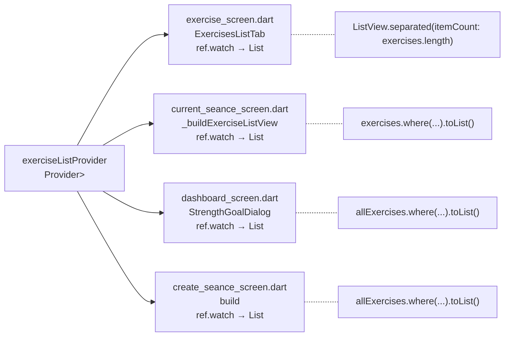
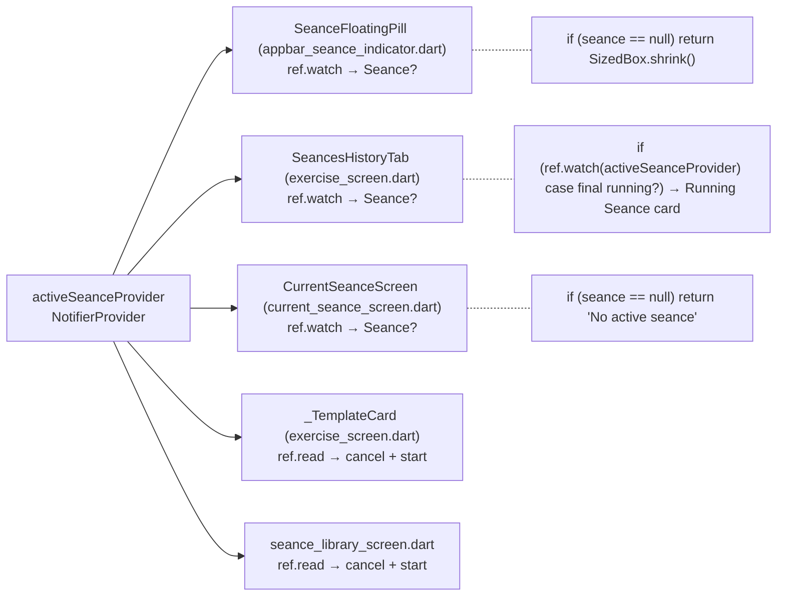
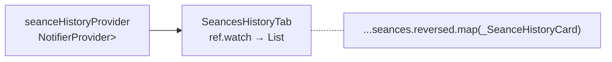
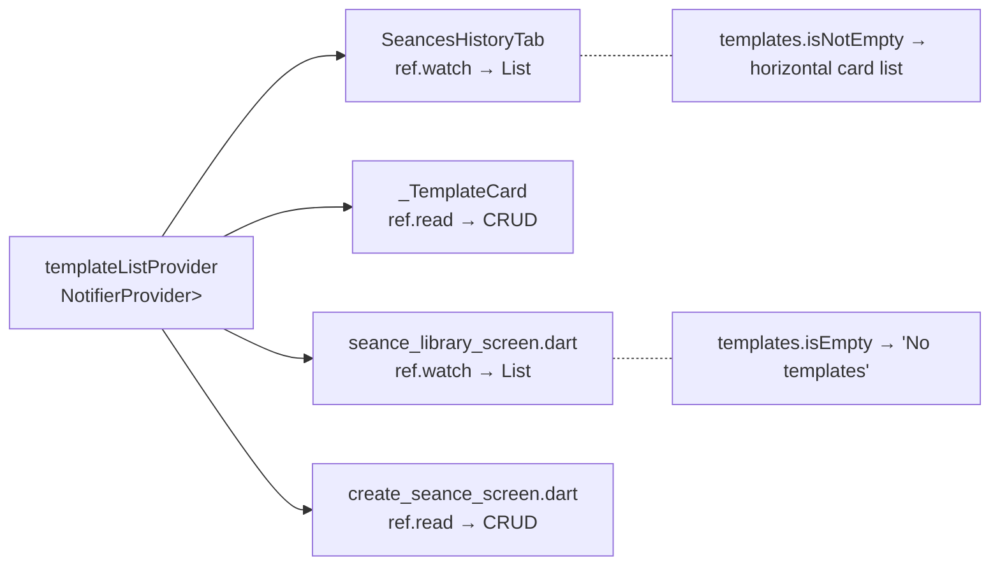
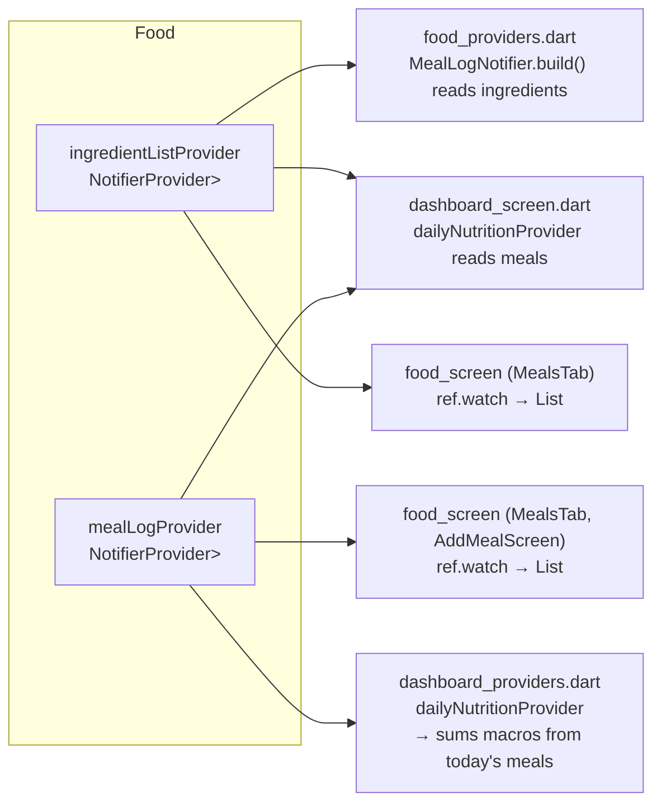
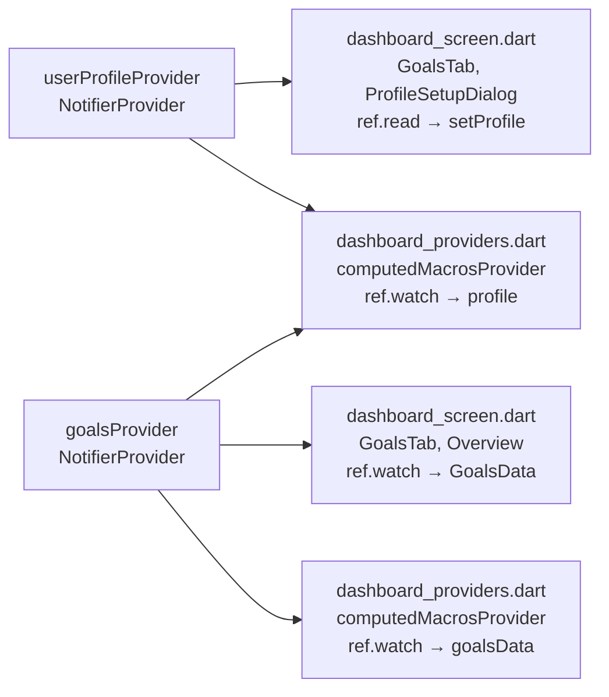

# Provider-Consumer Map

A diagram of which files depend on which Riverpod providers, so we know what breaks when we change a provider's type.

---

## Legend

```
PROVIDER (type)
├── screen/file.dart  (reads via ref.watch)
└── another/file.dart (reads via ref.read)
```

Changing a provider's type (e.g. `Provider` → `FutureProvider`) breaks **all consumers** because they expect a specific return type.

---

## 1. exerciseListProvider



**4 consumers.** All expect `List<ExerciseDefinition>` directly (no AsyncValue wrapping).

To migrate to DB: keep `Provider<List<ExerciseDefinition>>`, load data via `_loadFromDb()` in `main.dart` after `AppDatabase` is ready, or use a `Notifier` that loads async on build.

---

## 2. activeSeanceProvider



**5 consumers.** Already uses SharedPreferences JSON for persistence. Keep as-is until Drift migration covers seances.

---

## 3. seanceHistoryProvider



**1 consumer.** Currently in-memory seed. Need DB-backed implementation.

---

## 4. templateListProvider



**4 consumers.** Uses `SeanceRepository` port already. Just needs a Drift-backed implementation instead of the in-memory one.

---

## 5. ingredientListProvider + mealLogProvider



**Ingredient:** 3 consumers. **MealLog:** 3 consumers (+ dashboard's daily nutrition). 
These are the most complex because `MealLogNotifier.build()` reads `ingredientListProvider` — they're interdependent.

---

## 6. userProfileProvider + goalsProvider



**Profile:** 2 consumers. **Goals:** 3 consumers. Profile is simple (singleton). Goals has more methods (add/remove/update per type).

---

## Summary — what to touch for each change

| If you change... | Consumers to update |
|---|---|
| `exerciseListProvider` type | 4 files |
| `activeSeanceProvider` type | 5 files |
| `seanceHistoryProvider` type | 1 file |
| `templateListProvider` type | 4 files |
| `ingredientListProvider` type | 3 files |
| `mealLogProvider` type | 3 files |
| `userProfileProvider` type | 2 files |
| `goalsProvider` type | 3 files |

### Safest migration order

1. **exerciseListProvider** — simplest. Swap seed for DB call. Keep `Provider<List<ExerciseDefinition>>` type.
2. **userProfileProvider** + **goalsProvider** — next simplest. Persist via repo, keep type.
3. **ingredientListProvider** + **mealLogProvider** — hardest. Interdependent seed data. Need a plan.
4. **seanceHistoryProvider** + **templateListProvider** — needs full 3-table join (seances → entries → sets). Deferred.

The rule: **never change the provider type** (`Provider` → `FutureProvider`). Instead, keep the same type and load data inside the `build()` method or via `main.dart`.
