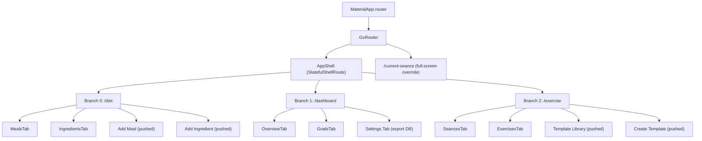
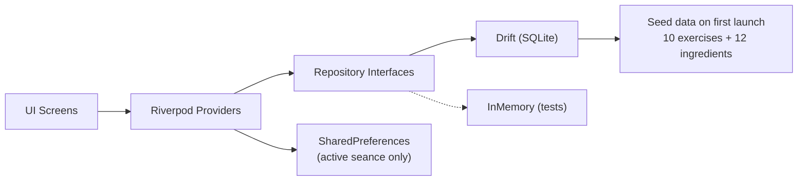

# fitfat — App Overview

fitfat is a Flutter mobile app for tracking fitness, nutrition, and workouts.
It runs fully offline on Android (with iOS support). All data lives on-device.

---

## What the app does

- **Track meals** — log what you eat with ingredients and macros
- **Track workouts (seances)** — start a workout, add exercises, log sets (reps × weight)
- **Dashboard** — see your daily nutrition, strength progression charts, goals
- **Templates** — create reusable workout templates with planned sets
- **Goals** — set bodyweight or strength goals (e.g., "Bench Press → 100 kg")

---

## How it's organized

```
fitfat/
├── lib/
│   ├── main.dart                  # App entry point
│   └── src/
│       ├── app.dart               # MaterialApp.router setup
│       ├── app_theme.dart         # Light/dark themes (Material 3)
│       ├── testing_flags.dart     # Test helpers (disable timers)
│       ├── router/
│       │   └── app_router.dart    # GoRouter routes + AppShell (bottom nav)
│       ├── screens/               # One folder per screen/tab
│       ├── providers/             # Riverpod state providers
│       ├── models/                # Hand-written Dart data classes
│       ├── database/              # Drift SQLite database
│       ├── repositories/          # Interfaces + implementations
│       ├── services/              # Background services (timer, notification)
│       └── widgets/               # Shared widgets
├── doc/                           # This documentation
├── test/                          # Unit + widget tests
├── pubspec.yaml                   # Dependencies
└── build.yaml                     # Drift codegen config
```

---

## Navigation structure



Each tab (branch) has its own **Navigator stack**. Pushing a screen inside Diet only affects the Diet tab's stack. The `/current-seance` route is registered **outside** the shell, so it covers the whole screen (including bottom navigation).

---

## Data flow



The app uses a **ports-and-adapters** pattern: providers depend on repository *interfaces*, not concrete implementations. This makes testing easy — swap the real Drift adapter for an in-memory one.

---

## State management philosophy

- **Lists** (exercises, ingredients, seance history) — loaded from DB on provider init, persisted immediately on mutations
- **Active seance** — saved to SharedPreferences as JSON for quick atomic save/restore (will move to Drift later)
- **UI state** (selected tab, edit dialog fields) — local `StatefulWidget` state, not in providers
- **Derived data** (computed macros, daily nutrition totals) — pure `Provider` that reads from other providers

All four provider files are in `lib/src/providers/`:
| Provider file | What it manages |
|---|---|
| `exercise_providers.dart` | Exercise definitions, active seance, seance history |
| `seance_providers.dart` | Templates (via SeanceRepository interface) |
| `food_providers.dart` | Ingredients, meal log |
| `dashboard_providers.dart` | Goals, user profile, computed macros, chart data |

---

## Key libraries

| Library | What it does |
|---|---|
| [Riverpod](https://riverpod.dev) | State management — provides/reads/watches state |
| [GoRouter](https://pub.dev/documentation/go_router/latest/) | Declarative routing with deep linking |
| [Drift](https://drift.simonbinder.eu) | SQLite ORM — type-safe database queries |
| [Flutter Foreground Task](https://pub.dev/packages/flutter_foreground_task) | Background timer notification |
| [fl_chart](https://pub.dev/packages/fl_chart) | Charts (strength progression line chart) |
| [SharedPreferences](https://pub.dev/packages/shared_preferences) | Simple key-value storage |
| [share_plus](https://pub.dev/packages/share_plus) | Share files (export database) |
| [intl](https://pub.dev/packages/intl) | Date/number formatting |
| [path_provider](https://pub.dev/packages/path_provider) | File system paths |

---

## Testing

- Unit tests test providers with `ProviderContainer` overrides
- Widget tests provide `ProviderScope` with overridden repos
- Drift test support: `AppDatabase.forTesting(NativeDatabase.memory())` creates an in-memory DB per test
