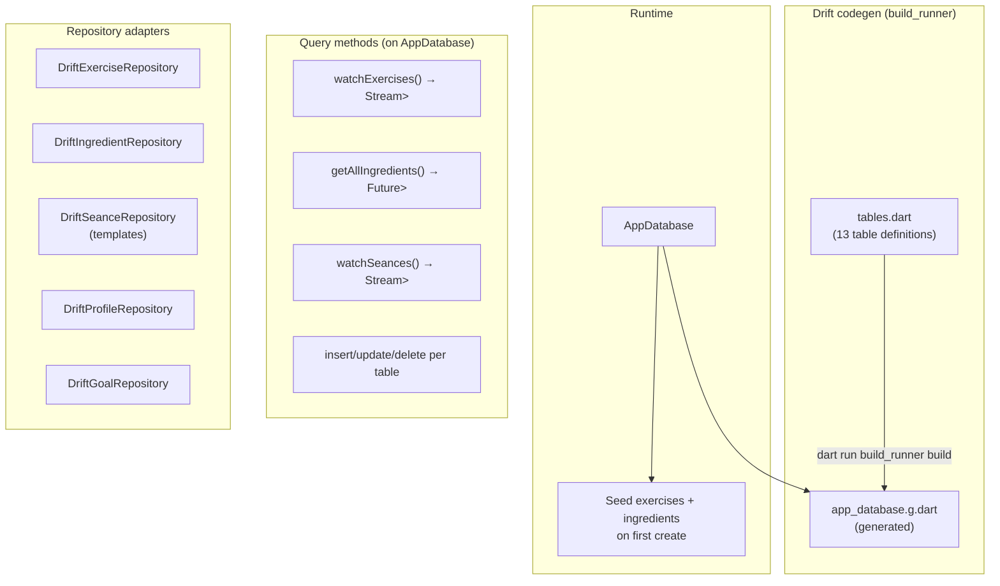

# Database Layer

## Architecture



The database layer has three parts:

1. **Table definitions** (`lib/src/database/tables.dart`) — Dart classes describing columns, types, and foreign keys
2. **Generated code** (`app_database.g.dart`) — created by `build_runner`, contains type-safe data classes, companions, and query helpers
3. **Query methods** — written directly on `AppDatabase`, use Drift's generated select/insert/update/delete API

---

## Tables

| Table | Purpose | Key columns |
|---|---|---|
| `exercises` | Exercise catalog (seed + user-created) | id, name, category |
| `ingredients` | Food ingredient catalog | id, name, calories/100g, protein/100g, carbs/100g, fat/100g |
| `meals` | Meal log entries | id, name, eatenAt, notes |
| `meal_ingredients` | Junction: which ingredient in which meal | mealId (FK), ingredientId (FK), grams |
| `seances` | Completed workouts | id, name, startedAt, completedAt |
| `exercise_entries` | Exercises within a seance | seanceId (FK), exerciseId (FK), startedAt |
| `exercise_sets` | Individual sets within an exercise entry | entryId (FK), reps, weight |
| `templates` | Reusable workout templates | id, name |
| `template_exercises` | Exercises in a template | templateId (FK), name (denormalized) |
| `template_sets` | Planned sets within a template exercise | templateExerciseId (FK), reps, weightKg, restSeconds |
| `goals` | Fitness goals (bodyweight + strength) | id, type, exerciseName, targetWeightKg, direction, targetDate |
| `user_profile` | User profile (singleton) | birthDate, sex, heightCm, weightKg, activityLevel |
| `body_weight_entries` | Body weight over time | date, weightKg |

---

## AppDatabase class

`lib/src/database/app_database.dart`

The central database class. Has 40+ query methods. Created once and shared via `databaseProvider`.

```dart
// Singleton provider
final databaseProvider = Provider<AppDatabase>((ref) {
  final db = AppDatabase();
  ref.onDispose(() => db.close());
  return db;
});
```

**Opening the database:**

```dart
LazyDatabase _openConnection() {
  return LazyDatabase(() async {
    final docsDir = await getApplicationDocumentsDirectory();
    final dbPath = p.join(docsDir.path, 'fitfat.db');
    return NativeDatabase(File(dbPath));
  });
}
```

The database file is `fitfat.db` in the app's documents directory. On Android this is at:
`/data/data/com.example.fitfat/app_flutter/fitfat.db`

**Seed data:** On first creation (`onCreate`), the database inserts 10 default exercises (Bench Press, Squats, Deadlifts, etc.) and 12 default ingredients (Chicken Breast, Rice, Eggs, etc.).

**Testing:** Use `AppDatabase.forTesting(NativeDatabase.memory())` for a fresh in-memory database per test.

---

## Query patterns

### Stream queries (reactive — UI rebuilds on data change)

```dart
Stream<List<Exercise>> watchExercises() => select(exercises).watch();
```

Used in providers so the UI automatically updates when DB data changes.

### Future queries (one-shot)

```dart
Future<List<Ingredient>> getAllIngredients() => select(ingredients).get();
```

### Insert

```dart
await db.into(db.exerciseSets).insert(
  ExerciseSetsCompanion.insert(id: uuid, entryId: entryId, reps: 10, weight: 60),
);
```

### Insert or replace

```dart
await db.into(db.seances).insertOnConflictUpdate(
  SeancesCompanion(id: Value(id), name: Value(name), ...),
);
```

### Delete with filter

```dart
await (db.delete(db.exerciseSets)
  ..where((t) => t.entryId.equals(entryId))).go();
```

---

## Companions

Drift generates a **Companion** class for each table. Companions are used for inserts and updates.

- `ExercisesCompanion.insert(...)` — all required fields
- `ExercisesCompanion(id: Value(id), name: Value(name))` — partial update
- `Value(null)` for nullable fields
- `Value(someValue)` for non-nullable fields that might need updating

---

## Migrations

The app is currently on schema version 1. Future changes to table definitions require:

```dart
@override
int get schemaVersion => 2; // bump this

@override
MigrationStrategy get migration => MigrationStrategy(
  onCreate: (m) async { /* creates all tables + seeds */ },
  onUpgrade: (m, from, to) async {
    if (from < 2) {
      await m.addColumn(exercises, exercises.newField);
    }
  },
);
```

---

## Name conflicts with hand-written models

Drift generates classes like `Exercise`, `Seance`, `ExerciseEntry`, `ExerciseSet` that conflict with the hand-written models in `exercise_models.dart`. When importing both, use `hide`:

```dart
import '../database/app_database.dart' hide Seance, ExerciseEntry, ExerciseSet, Exercise;
import '../models/exercise_models.dart';
```

---

## Drift links

| What | Link |
|---|---|
| Getting started | https://drift.simonbinder.eu/docs/getting-started/ |
| Table definitions | https://drift.simonbinder.eu/docs/tables/ |
| Queries | https://drift.simonbinder.eu/docs/queries/ |
| Migrations | https://drift.simonbinder.eu/docs/migrations/ |
| Codegen setup | https://drift.simonbinder.eu/docs/getting-started/#setup |
| Companions & inserts | https://drift.simonbinder.eu/docs/tables/#modifications |
| In-memory for testing | https://drift.simonbinder.eu/docs/testing/ |
| Riverpod integration | https://drift.simonbinder.eu/docs/examples/riverpod |
