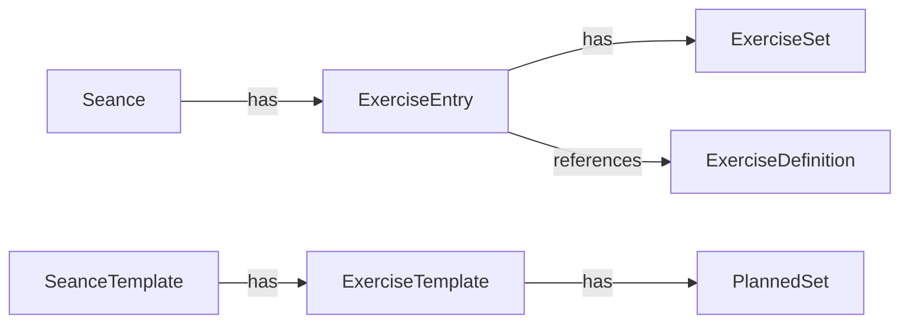
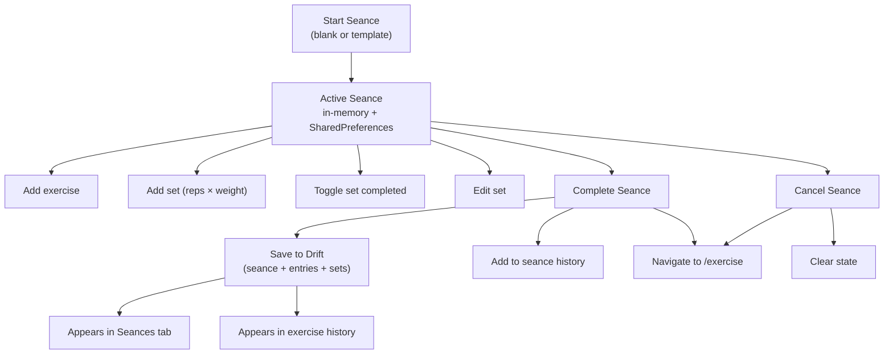
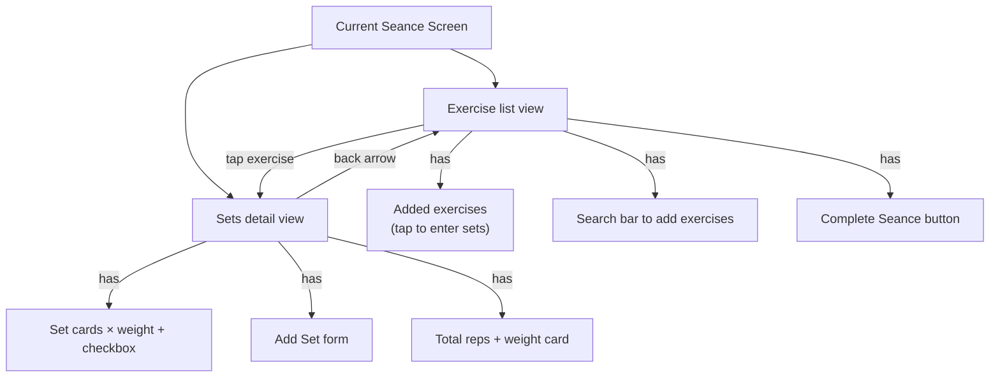
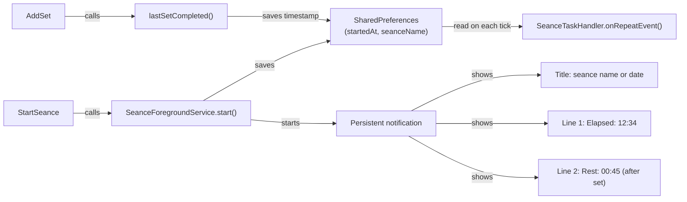

# Seance System

The seance (workout) system is the most complex feature in fitfat. This doc explains how it works end-to-end.

---

## Data model



### Live vs completed

During a workout, the `Seance` object is held in `ActiveSeanceNotifier` (in-memory with SharedPreferences backup). When completed, it's saved to Drift SQLite as completed data (seance + entries + sets).

---

## Seance lifecycle



### Starting a seance

```dart
// Blank seance — no exercises, no planned sets
ref.read(activeSeanceProvider.notifier).startSeance();

// From template — exercises + planned sets pre-populated
ref.read(activeSeanceProvider.notifier).startSeanceFromTemplate(template);
```

Both methods push the `/current-seance` route to show the seance UI.

### Completing a seance

```dart
void completeSeance() {
  final completed = Seance(
    id: state!.id,
    name: state!.name ?? defaultName, // "Seance - dd/mm/yy hh:mm" if blank
    exercises: state!.exercises,
    completedAt: DateTime.now(),
  );
  // Save to history + Drift
  ref.read(seanceHistoryProvider.notifier).addSeance(completed);
  state = null;
  // Navigate back
  context.go('/exercise');
}
```

A completed seance gets saved to Drift SQLite (seances table + exercise_entries + exercise_sets).

---

## Current seance screen



**Key behaviors:**
- Adding a set auto-completes the new set and any prior incomplete sets
- A taskbar shows `HH:mm` completion time per set
- All sets can be toggled complete/incomplete via checkbox
- Tapping a set opens an edit dialog for reps/weight

---

## Templates

Templates are stored in Drift across 3 tables: `templates` → `template_exercises` → `template_sets`.

```dart
class DriftSeanceRepository implements SeanceRepository {
  // Create: insert template, then each exercise, then each planned set
  // Read: select template, join exercises, join sets
  // Update: delete old, re-insert new
  // Delete: cascade delete sets → exercises → template
}
```

Templates are created from the Seances tab and can be edited, cloned, or deleted.

---

## History

Completed seances appear in:
1. **Seances tab** — list of all completed seances with redesigned cards (date header, per-exercise set summaries)
2. **Exercise history** — tap any exercise in the Exercises tab to see all seances containing that exercise, with per-set details and best set tracking

---

## Background timer & notification



The notification runs in a **background isolate** via `flutter_foreground_task`. It:
- Shows elapsed time since seance started
- Shows rest time since last set (re-reads from SharedPreferences every second)
- Tapping the notification opens the current seance screen

---

## Persistence summary

| Data | Where saved | Survives restart |
|---|---|---|
| Active seance | SharedPreferences (JSON) | ✅ Yes |
| Completed seances | Drift SQLite (3 tables) | ✅ Yes |
| Templates | Drift SQLite (3 tables) | ✅ Yes |
| Exercise definitions | Drift SQLite | ✅ Yes |
| Ingredients | Drift SQLite | ✅ Yes |
| Meals + meal log | In-memory only | ❌ No (food deferred) |
| Goals | Drift SQLite (goals table) | ✅ Yes |
| Profile | Drift SQLite (user_profile) | ✅ Yes |
| Body weight entries | Drift SQLite | ✅ Yes |
