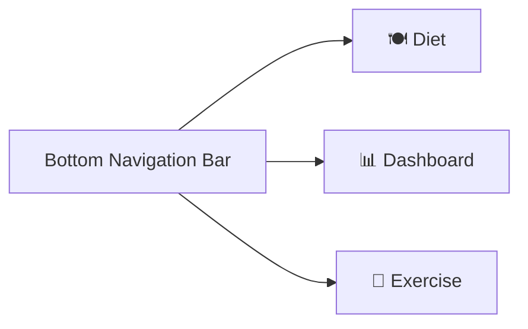
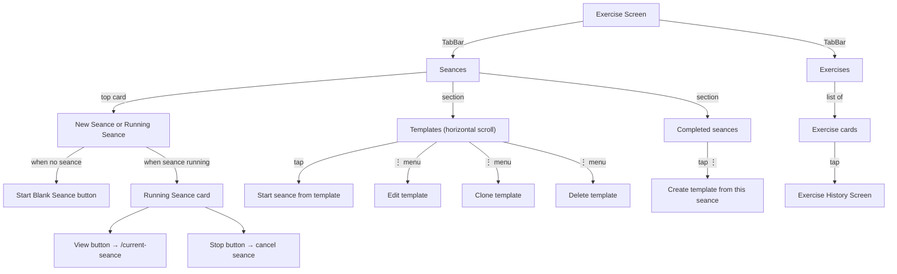
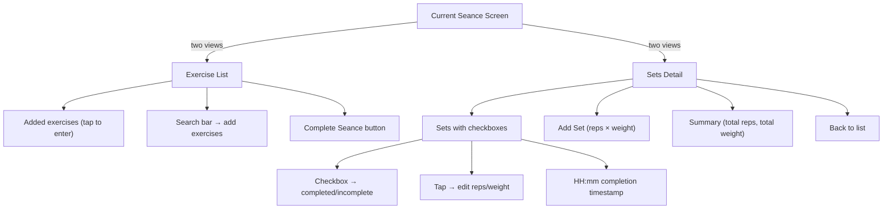
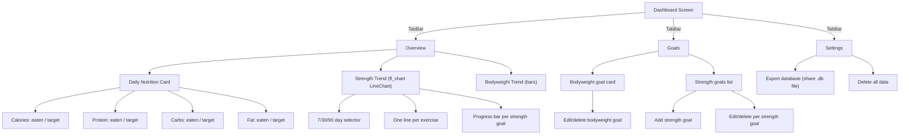

# Screens & User Interface

## Bottom navigation



The app has 3 tabs accessible via the bottom navigation bar. A 4th screen (Current Seance) appears as a full-screen overlay when a seance is active.

---

## Diet tab

```mermaid
flowchart TD
    Diet["Diet Screen"] -->|TabBar| MealsTab["Meals"]
    Diet -->|TabBar| IngredientsTab["Ingredients"]
    
    MealsTab -->|list of| MealCards["Meal cards"]
    MealCards -->|each shows| MealName["Meal name"]
    MealCards -->|each shows| MealMacros["Total macros"]
    
    IngredientsTab -->|list of| IngredientCards["Ingredient cards"]
    IngredientCards -->|each shows| IngName["Name"]
    IngredientCards -->|each shows| IngMacros["Calories/100g"]
    
    MealsTab -->|FAB "Add Meal"| AddMeal["Add Meal Screen"]
    IngredientsTab -->|FAB "Add Ingredient"| AddIngredient["Add Ingredient Screen"]
    
    AddMeal -->|search & select| IngredientPicker["Ingredient picker"]
    AddMeal -->|set| Grams["Grams per ingredient"]
    
    AddIngredient -->|fields| IngForm["Name, calories, protein, carbs, fat"]
```

**Key files:** `lib/src/screens/diet/diet_screen.dart`, `lib/src/screens/food/add_meal_screen.dart`, `lib/src/screens/food/custom_ingredient_screen.dart`

---

## Exercise tab



**Key files:** `lib/src/screens/exercise/exercise_screen.dart`, `lib/src/screens/exercise/seance_library_screen.dart`, `lib/src/screens/exercise/create_seance_screen.dart`, `lib/src/screens/exercise/exercise_history_screen.dart`, `lib/src/screens/exercise/current_seance_screen.dart`

### Current Seance Screen (full-screen overlay)



---

## Dashboard tab



**Key files:** `lib/src/screens/dashboard/dashboard_screen.dart`

---

## Floating pill

When a seance is running, a floating `SeanceFloatingPill` widget appears at the bottom-right of every screen. It shows the elapsed time and is tappable to open the seance screen.

```dart
// Rendered in AppShell (app_router.dart)
body: Stack(children: [
  navigationShell,
  const Positioned(right: 16, bottom: 16, child: SeanceFloatingPill()),
]),
```

The pill:
- Uses `primaryContainer` theme color
- Shows 6px elevation shadow
- Updates every second via a periodic Timer
- Returns `SizedBox.shrink()` when no seance is active
