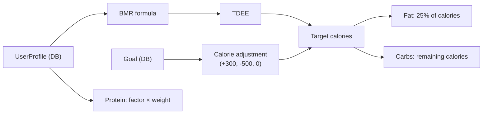

# Dashboard: Goals & Macros

## How goals work

The app has two goal types:

```dart
sealed class Goal {
  const Goal();
}

class StrengthGoal extends Goal {
  // Target a specific exercise: "Bench Press → 100 kg"
  final String exerciseName;
  final double targetWeightKg;
  final DateTime? targetDate;
}

class BodyWeightGoal extends Goal {
  // Gain, lose, or maintain to a target weight
  final double targetWeightKg;
  final BodyWeightDirection direction; // gain | lose | maintain
  final DateTime? targetDate;
}
```

Goals are stored in the `goals` Drift table and managed via `GoalsNotifier`.

---

## Profile & TDEE

The user's profile drives macro computation:

| Field | Input type | Stored as |
|---|---|---|
| Birthdate | Date picker | DateTime → computes age |
| Sex | Male / Female | String in DB |
| Height | Number (cm) | double |
| Weight | Number (kg) | double |
| Activity level | 5 levels: Sedentary → Very Active | String in DB |

### Mifflin-St Jeor formula

```dart
double _bmr(UserProfile profile) {
  final base = 10 * weight + 6.25 * height - 5 * age;
  return switch (sex) {
    Sex.male => base + 5,
    Sex.female => base - 161,
  };
}
```

TDEE = BMR × activity factor (1.2 to 1.9).

### Macro computation

| Goal type | Calorie target | Protein | Fat | Carbs |
|---|---|---|---|---|
| Bodyweight — gain | TDEE + 300 | 2.0g/kg | 25% | Remainder |
| Bodyweight — lose | TDEE - 500 | 2.4g/kg | 25% | Remainder |
| Bodyweight — maintain | TDEE | 1.8g/kg | 25% | Remainder |
| Strength | TDEE | 2.2g/kg | 25% | Remainder |
| No goal (profile only) | TDEE maintenance | 1.8g/kg | 25% | Remainder |

### Activity level multipliers

| Level | Factor | Description |
|---|---|---|
| Sedentary | 1.2 | Little/no exercise |
| Light | 1.375 | 1-3 days/week |
| Moderate | 1.55 | 3-5 days/week |
| Active | 1.725 | 6-7 days/week |
| Very Active | 1.9 | Twice daily |

### Data flow



The computation is done in `computedMacrosProvider` (a pure `Provider`, no DB read).

---

## Dashboard views

The Dashboard has 3 tabs:

1. **Overview** — DailyNutritionCard (showing computed macros), StrengthTrendChart (fl_chart with per-exercise lines + period selector), BodyweightTrendChart
2. **Goals** — Manage bodyweight goal (one only) + strength goals (one per exercise). Add/edit/delete each.
3. **Settings** — Export database (share fitfat.db) / Delete all data
