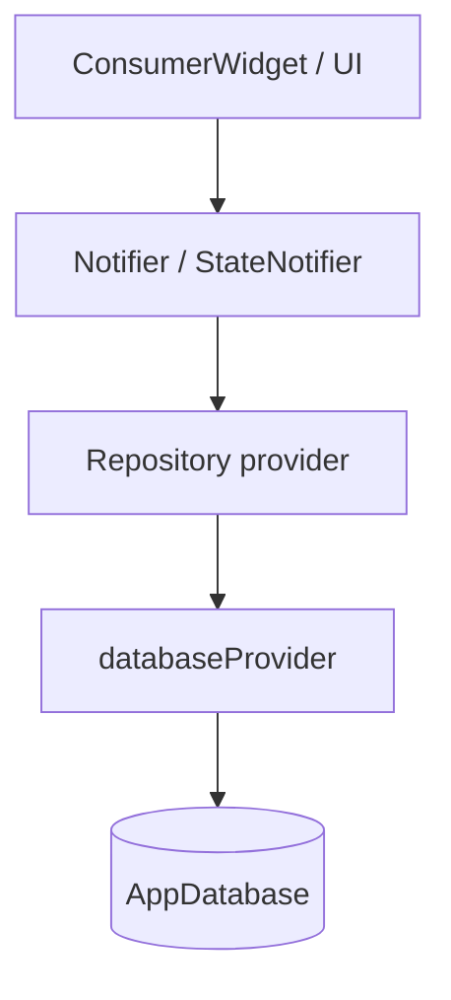

# Riverpod CRUD example

This document shows a simple pattern for building a **view + provider + controller + repository + database provider** flow in Flutter with Riverpod.

The goal is:
- keep UI code in the view,
- keep business logic in the controller,
- keep persistence in the repository,
- keep database creation in a Riverpod provider.

The example below uses a list of `Ingredient` items, but the same structure works for meals, exercises, templates, or any other CRUD list.

## Architecture



## Suggested file split

```text
lib/src/
  database/app_database.dart
  models/ingredient.dart
  repositories/ingredient_repository.dart
  repositories/drift/drift_ingredient_repository.dart
  providers/database_providers.dart
  providers/ingredient_providers.dart
  features/ingredient_list/ingredient_list_view.dart
```

## 1) Model

```dart
class Ingredient {
  final String id;
  final String name;
  final double quantity;

  const Ingredient({
    required this.id,
    required this.name,
    required this.quantity,
  });

  Ingredient copyWith({String? id, String? name, double? quantity}) {
    return Ingredient(
      id: id ?? this.id,
      name: name ?? this.name,
      quantity: quantity ?? this.quantity,
    );
  }
}
```

## 2) Repository contract

The repository is responsible for talking to the database.

```dart
abstract class IngredientRepository {
  Future<List<Ingredient>> listAll();
  Future<Ingredient> create(Ingredient ingredient);
  Future<Ingredient> update(Ingredient ingredient);
  Future<void> delete(String id);
}
```

## 3) Database provider

This is the Riverpod provider that creates and disposes your database.

```dart
import 'package:flutter_riverpod/flutter_riverpod.dart';
import '../database/app_database.dart';

final databaseProvider = Provider<AppDatabase>((ref) {
  final db = AppDatabase();
  ref.onDispose(() => db.close());
  return db;
});
```

If you want a different database for development or tests, you can add another provider the same way, like `devDatabaseProvider`.

## 4) Repository provider

The repository provider wires the database into the concrete repository implementation.

```dart
import 'package:flutter_riverpod/flutter_riverpod.dart';
import '../database/app_database.dart';
import '../repositories/ingredient_repository.dart';
import '../repositories/drift/drift_ingredient_repository.dart';
import 'database_providers.dart';

final ingredientRepositoryProvider = Provider<IngredientRepository>((ref) {
  final db = ref.watch(databaseProvider);
  return DriftIngredientRepository(db);
});
```

## 5) Controller

The controller holds the UI state and business logic.

You can use either `StateNotifier` or `Notifier`.

- Use `Notifier` for newer Riverpod code.
- Use `StateNotifier` if you already have an existing pattern built around immutable state classes.

Below is a clean `Notifier` example for a CRUD list:

```dart
import 'package:flutter_riverpod/flutter_riverpod.dart';
import '../models/ingredient.dart';
import '../repositories/ingredient_repository.dart';
import 'ingredient_providers.dart';

class IngredientListController extends Notifier<List<Ingredient>> {
  late final IngredientRepository _repo;

  @override
  List<Ingredient> build() {
    _repo = ref.read(ingredientRepositoryProvider);
    _loadInitialData();
    return const [];
  }

  Future<void> _loadInitialData() async {
    final items = await _repo.listAll();
    state = items;
  }

  Future<void> addIngredient(Ingredient ingredient) async {
    final created = await _repo.create(ingredient);
    state = [...state, created];
  }

  Future<void> updateIngredient(Ingredient ingredient) async {
    final updated = await _repo.update(ingredient);
    state = [
      for (final item in state)
        if (item.id == updated.id) updated else item,
    ];
  }

  Future<void> removeIngredient(String id) async {
    await _repo.delete(id);
    state = state.where((item) => item.id != id).toList();
  }
}

final ingredientListControllerProvider =
    NotifierProvider<IngredientListController, List<Ingredient>>(
  IngredientListController.new,
);
```

### Why the controller is the right place for CRUD logic

- it validates input before saving,
- it decides when to refresh the list,
- it updates local state after database operations,
- it keeps widgets simple.

## 6) View

The view watches the controller provider and calls controller methods.

```dart
import 'package:flutter/material.dart';
import 'package:flutter_riverpod/flutter_riverpod.dart';
import '../../models/ingredient.dart';
import '../../providers/ingredient_providers.dart';

class IngredientListView extends ConsumerWidget {
  const IngredientListView({super.key});

  @override
  Widget build(BuildContext context, WidgetRef ref) {
    final ingredients = ref.watch(ingredientListControllerProvider);
    final controller = ref.read(ingredientListControllerProvider.notifier);

    return Scaffold(
      appBar: AppBar(title: const Text('Ingredients')),
      floatingActionButton: FloatingActionButton(
        onPressed: () {
          controller.addIngredient(
            Ingredient(
              id: DateTime.now().millisecondsSinceEpoch.toString(),
              name: 'Banana',
              quantity: 1,
            ),
          );
        },
        child: const Icon(Icons.add),
      ),
      body: ListView.separated(
        itemCount: ingredients.length,
        separatorBuilder: (_, __) => const Divider(height: 1),
        itemBuilder: (context, index) {
          final item = ingredients[index];
          return ListTile(
            title: Text(item.name),
            subtitle: Text('Quantity: ${item.quantity}'),
            trailing: Row(
              mainAxisSize: MainAxisSize.min,
              children: [
                IconButton(
                  icon: const Icon(Icons.edit),
                  onPressed: () {
                    controller.updateIngredient(
                      item.copyWith(name: '${item.name} (edited)'),
                    );
                  },
                ),
                IconButton(
                  icon: const Icon(Icons.delete),
                  onPressed: () => controller.removeIngredient(item.id),
                ),
              ],
            ),
          );
        },
      ),
    );
  }
}
```

## 7) How the pieces work together

1. The **view** watches `ingredientListControllerProvider`.
2. The **controller** reads `ingredientRepositoryProvider`.
3. The **repository provider** reads `databaseProvider`.
4. The **repository** talks to Drift / SQLite.
5. The **controller** updates its `state`, and the **view** rebuilds automatically.

## 8) Practical notes

- If the database changes outside the controller, consider a `Stream`-based repository method and subscribe in the controller.
- If your list needs loading/error states, make the controller state a custom class instead of `List<Ingredient>`.
- If you already have a pattern like `MealListState` or `IngredientPageState`, keep using that for richer UI feedback.

## 9) Relation to this repo

Your code already follows this pattern:

- `lib/src/providers/database_providers.dart` creates the database provider.
- `lib/src/providers/repositories.dart` wires repositories to the database.
- `lib/src/providers/meal_controller_provider.dart` shows a `Notifier`-based controller.
- `lib/src/providers/food_providers.dart` shows a `StateNotifier`-based controller with a richer state object.

If you want, I can also turn this into a **repo-specific example** using your actual `MealEntry`, `SeanceTemplate`, or `Ingredient` types.